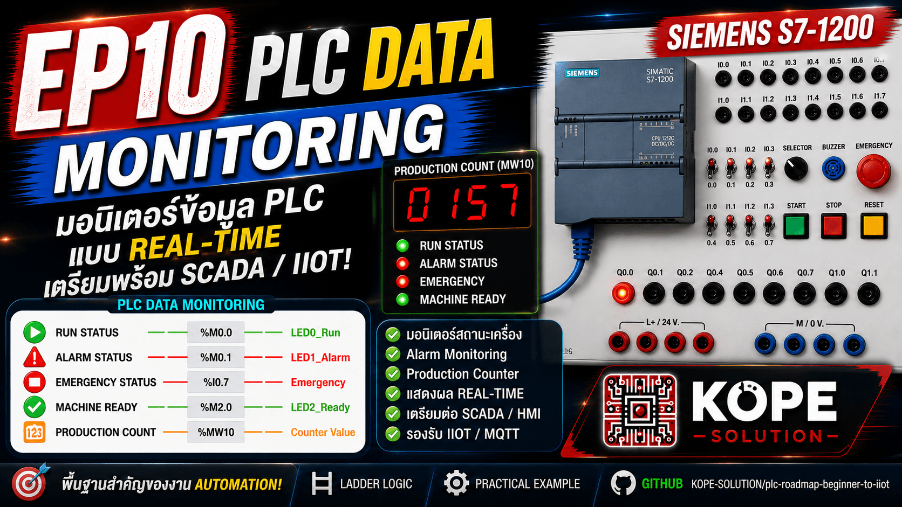
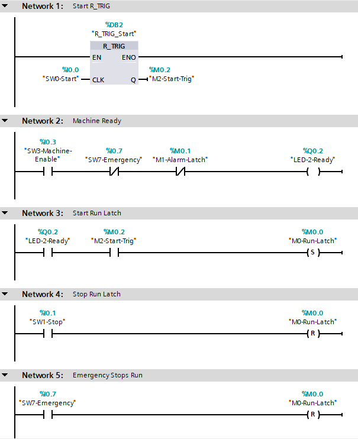
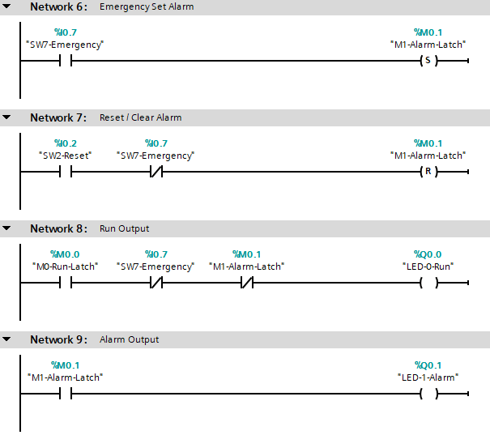
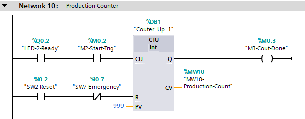

# EP10 — PLC Data Monitoring & Alarm Recovery

This episode introduces PLC internal data monitoring using Siemens S7-1200 PLC.

The goal is to create realistic machine data that can be monitored later by HMI, SCADA, Node-RED, MQTT, or IIoT dashboards.



---

## Topics

- PLC Data Monitoring
- Machine Run Status
- Alarm Latch
- Emergency Status
- Production Counter
- Manual Recovery
- SCADA / HMI / IIoT Preparation

---

## Industrial Concept

Emergency is used to stop and protect the machine.

Reset is used after the problem is solved to clear alarm status and prepare the machine for restart.

```text
Emergency = Stop / Alarm / Block Start
Reset     = Clear Alarm / Reset Count
```

---

## Inputs

| Tag                | Address | Description         |
| ------------------ | ------: | ------------------- |
| SW0_Start_Button   |   %I0.0 | Start Button        |
| SW1_Stop_Button    |   %I0.1 | Stop Button         |
| SW2_Reset_Button   |   %I0.2 | Reset / Clear Alarm |
| SW3_Machine_Enable |   %I0.3 | Machine Enable      |
| SW7_Emergency      |   %I0.7 | Emergency Stop      |


---

## Outputs

| Tag        | Address | Description     |
| ---------- | ------: | --------------- |
| LED0_Run   |   %Q0.0 | Machine Running |
| LED1_Alarm |   %Q0.1 | Alarm Status    |
| LED2_Ready |   %Q0.2 | Machine Ready   |

---

## Memory Tags

| Tag                   | Address | Description              |
| --------------------- | ------: | ------------------------ |
| M0_Run_Latch          |   %M0.0 | Machine Run Status       |
| M1_Alarm_Latch        |   %M0.1 | Alarm Latch              |
| M2_Start_Trig         |   %M0.2 | Start One-Shot Trigger   |
| M3_Count_Done         |   %M0.3 | Counter Done             |
| MW10_Production_Count |   %MW10 | Production Counter Value |


---

## Ladder Logic





---

## Expected Result

| Action            | Result                                                 |
| ----------------- | ------------------------------------------------------ |
| Machine Enable ON | Ready LED turns ON                                     |
| Press Start       | Run LED turns ON and Counter increases                 |
| Press Stop        | Run LED turns OFF, Counter value remains               |
| Press Start again | Run LED turns ON and Counter increases                 |
| Press Emergency   | Run LED turns OFF, Alarm LED turns ON, Counter remains |
| Release Emergency | Alarm remains ON, machine cannot restart               |
| Press Reset       | Alarm clears, Counter resets, Ready returns            |
| Press Start again | Machine runs again                                     |

---

## Key Learning

PLC data is not only output control.

A PLC also stores internal machine information such as:
- Run status
- Alarm status
- Ready status
- Emergency status
- Counter value

<br>

This data is the foundation for:
- HMI
- SCADA
- Dashboard
- MQTT
- Node-RED
- IIoT systems

---

## Important Concept

- Emergency stops the machine and creates an alarm.
- Reset is used after the operator checks the machine and clears the alarm.
- This is an important concept in real industrial automation systems.