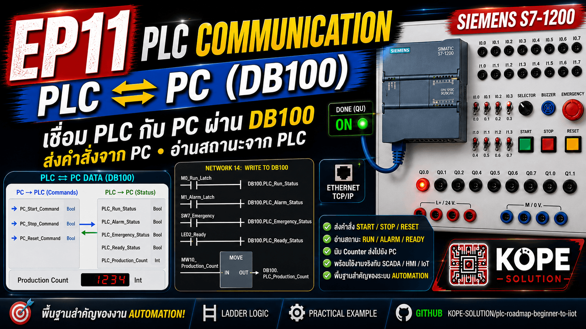
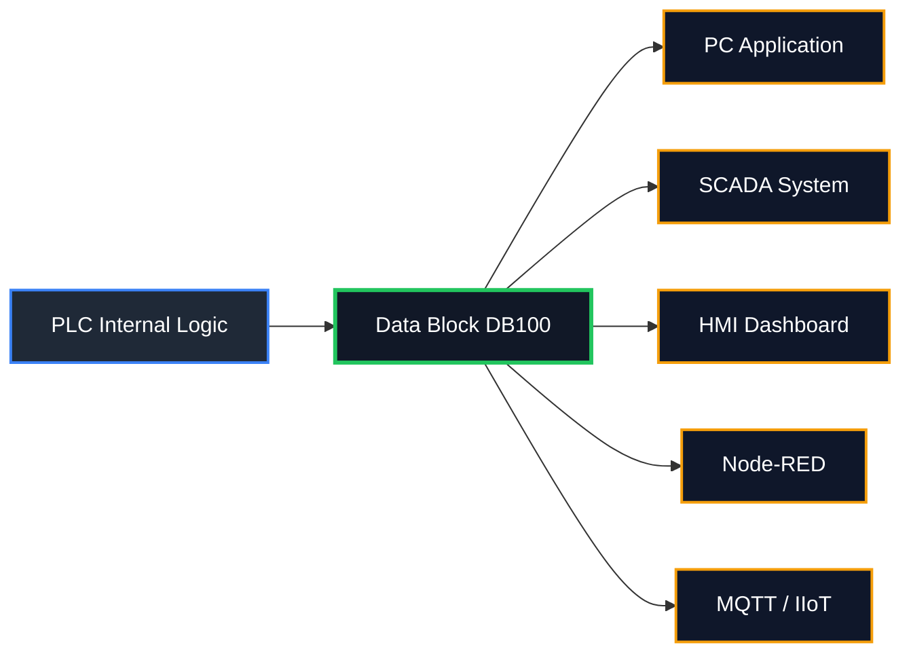
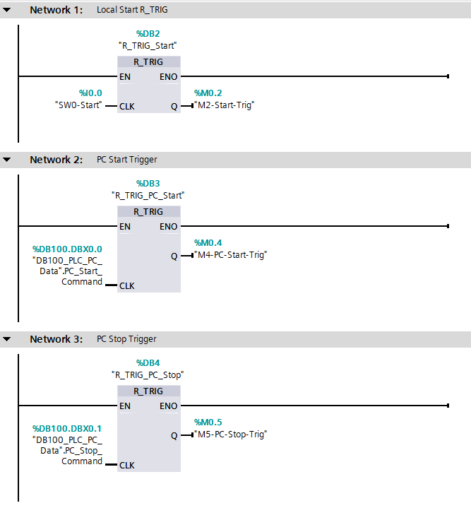
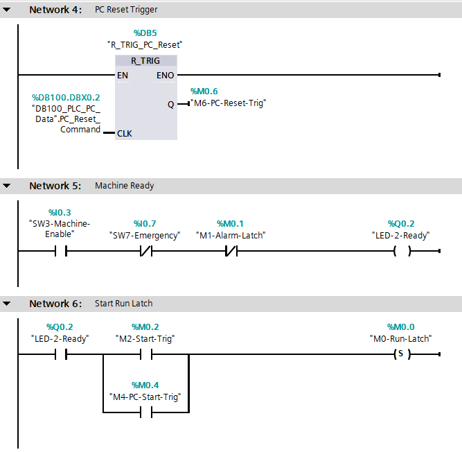
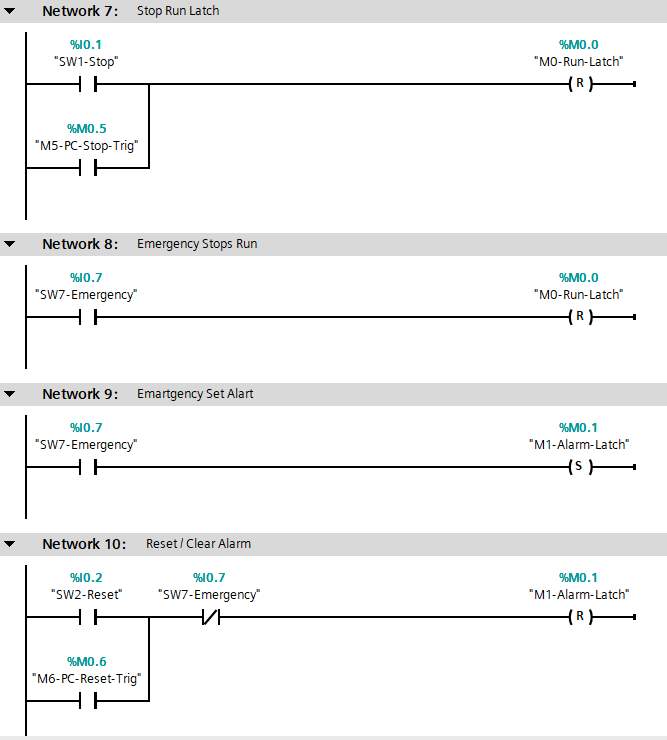
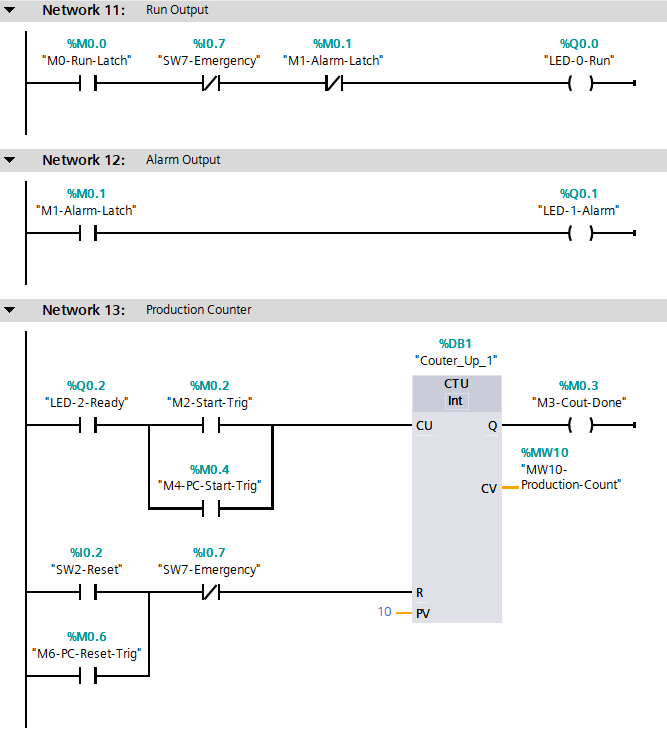
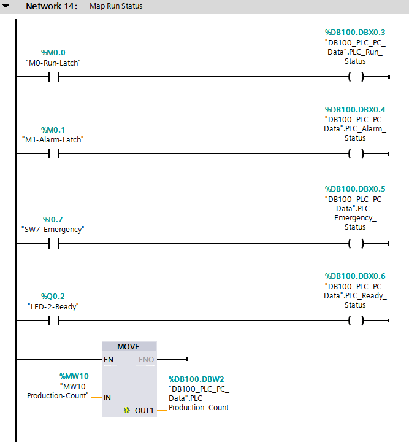

# EP11 — PLC Communication with PC

This episode introduces basic PLC communication with a PC using Siemens S7-1200 PLC.

The main goal is to prepare PLC data so that external systems such as PC software, SCADA, Python, Node-RED, or IIoT dashboards can read machine status and send basic commands.



---

## Topics

- PLC to PC Communication
- Data Block for Communication
- Machine Status Monitoring
- PC Command Control
- Start / Stop / Reset from PC
- SCADA / HMI / IIoT Preparation

---

## Concept

In previous episodes, the PLC controlled outputs directly.

In this episode, the PLC also prepares internal data for external monitoring.



The PC can also send command bits back to the PLC:
```sh
PC Start
PC Stop
PC Reset
```

---

## Inputs

| Tag                | Address | Description        |
| ------------------ | ------: | ------------------ |
| SW0_Start_Button   |   %I0.0 | Local Start Button |
| SW1_Stop_Button    |   %I0.1 | Local Stop Button  |
| SW2_Reset_Button   |   %I0.2 | Local Reset Button |
| SW3_Machine_Enable |   %I0.3 | Machine Enable     |
| SW7_Emergency      |   %I0.7 | Emergency Stop     |


---

## Outputs

| Tag        | Address | Description     |
| ---------- | ------: | --------------- |
| LED0_Run   |   %Q0.0 | Machine Running |
| LED1_Alarm |   %Q0.1 | Alarm Status    |
| LED2_Ready |   %Q0.2 | Machine Ready   |


---

## Communication Data Block

Create a Data Block: `DB100_PLC_PC_Data`

Recommended for external PC access: `Optimized block access = OFF`

---

## DB100 Tags

| Tag                  | Type | Description            |
| -------------------- | ---- | ---------------------- |
| PC_Start_Command     | Bool | Start command from PC  |
| PC_Stop_Command      | Bool | Stop command from PC   |
| PC_Reset_Command     | Bool | Reset command from PC  |
| PLC_Run_Status       | Bool | Machine run status     |
| PLC_Alarm_Status     | Bool | Alarm status           |
| PLC_Emergency_Status | Bool | Emergency status       |
| PLC_Ready_Status     | Bool | Machine ready status   |
| PLC_Production_Count | Int  | Production count value |

---

## Ladder Logic Summary







---

## Expected Result

| Action                         | Result                                                 |
| ------------------------------ | ------------------------------------------------------ |
| Local Start                    | Machine runs                                           |
| PC Start Command               | Machine runs if Ready                                  |
| Local Stop                     | Machine stops                                          |
| PC Stop Command                | Machine stops                                          |
| Emergency                      | Machine stops and Alarm turns ON                       |
| Reset after Emergency released | Alarm clears                                           |
| PC reads DB100                 | PC can monitor Run, Alarm, Emergency, Ready, and Count |


---

## Important Safety Concept

PC commands should not bypass safety logic.

Even if the PC sends Start command, the PLC must check:
- Machine Enable ON
- Emergency OFF
- Alarm OFF

This prevents unsafe remote starting.

---

## Industrial Concept

A PC or SCADA system should normally be used for:
- Monitoring
- Operator commands
- Data logging
- Dashboard
- Alarm display

But safety logic must remain inside the PLC and hardware safety circuit.

---

## Learning Outcome
- Understand how PLC data is prepared for PC monitoring
- Learn how to use a Data Block for communication
- Learn how PC command bits can control PLC logic
- Understand safe command handling
- Prepare for SCADA, Node-RED, MQTT, and IIoT systems