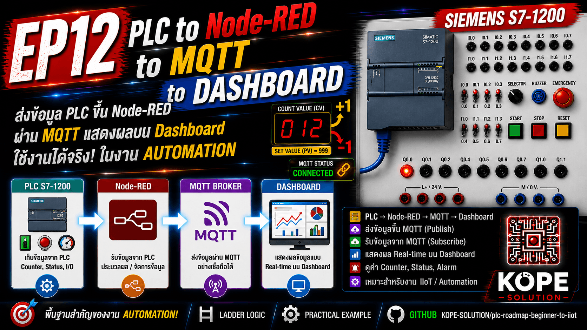

# EP12 — PLC to MQTT / Node-RED

This episode introduces Industrial IoT communication using Siemens S7-1200 PLC.

The goal is to send PLC machine data to Node-RED and publish it to an MQTT Broker.



---

## System Architecture


---

## Main Goal

In this EP, we will build the first Industrial IoT data flow: `PLC → Node-RED → MQTT Broker`

The PLC still controls the machine.

Node-RED reads PLC data and publishes it as MQTT messages.

---

## Installation References

This EP assumes that MQTT Broker and Node-RED are already installed.

Installation tutorials are provided separately.

MQTT Broker Installation Video : https://youtu.be/bqaUgJ9S1r4?si=shDTQIy2qeHcs2Lk

Node-RED Installation Video : https://youtu.be/Uv2iJd1kcRI?si=D-uoV6qVMWoPAJWk

---

## Connection Information

> Do not commit real credentials to a public repository.

## MQTT Broker

| Item           | Value                |
| -------------- | -------------------- |
| Host           | `<MQTT_BROKER_HOST>` |
| Port           | `<MQTT_BROKER_PORT>` |
| Authentication | Enabled              |
| Username       | `<MQTT_USERNAME>`    |
| Password       | `<MQTT_PASSWORD>`    |


## Node-RED

| Item           | Value                                    |
| -------------- | ---------------------------------------- |
| URL            | `http://<NODE_RED_HOST>:<NODE_RED_PORT>` |
| Authentication | Enabled                                  |
| Username       | `<NODE_RED_USERNAME>`                    |
| Password       | `<NODE_RED_PASSWORD>`                    |


---

## DB100 Communication Data

Use the same DB100 from EP11.

| Tag                  | Type | Address      | Description        |
| -------------------- | ---- | ------------ | ------------------ |
| PC_Start_Command     | Bool | DB100.DBX0.0 | Start Command      |
| PC_Stop_Command      | Bool | DB100.DBX0.1 | Stop Command       |
| PC_Reset_Command     | Bool | DB100.DBX0.2 | Reset Command      |
| PLC_Run_Status       | Bool | DB100.DBX0.3 | Machine Running    |
| PLC_Alarm_Status     | Bool | DB100.DBX0.4 | Alarm Active       |
| PLC_Emergency_Status | Bool | DB100.DBX0.5 | Emergency Active   |
| PLC_Ready_Status     | Bool | DB100.DBX0.6 | Machine Ready      |
| PLC_Production_Count | Int  | DB100.DBW2   | Production Counter |

---

## Step-by-Step Lab

### Step 1 — Prepare PLC Data

Make sure EP11 is working correctly.

Open Watch Table in TIA Portal and verify:

| Data                 | Expected                                |
| -------------------- | --------------------------------------- |
| PLC_Run_Status       | Changes when machine runs               |
| PLC_Alarm_Status     | TRUE when alarm active                  |
| PLC_Emergency_Status | TRUE when emergency pressed             |
| PLC_Ready_Status     | TRUE when machine ready                 |
| PLC_Production_Count | Increases when production count changes |

### Step 2 — Open Node-RED

Open Node-RED in a web browser: `http://<NODE_RED_HOST>:<NODE_RED_PORT>`

Login using your own Node-RED credential.

### Step 3 — Install Required Node-RED Nodes

In Node-RED: `Menu → Manage palette → Install`

Install a Siemens S7 communication node, for example: `node-red-contrib-s7`

You may also use other S7-compatible nodes depending on your environment.

### Step 4 — Create S7 PLC Connection

Create a PLC connection in Node-RED.

Example settings:

| Setting        | Value              |
| -------------- | ------------------ |
| PLC IP Address | `<PLC_IP_ADDRESS>` |
| Rack           | `0`                |
| Slot           | `1`                |
| Cycle Time     | `1000 ms`          |

> For Siemens S7-1200, Rack 0 / Slot 1 is commonly used.

### Step 5 — Read PLC Data from DB100

Create S7 variables for DB100.

Example:

| Variable  | Address    |
| --------- | ---------- |
| run       | DB100,X0.3 |
| alarm     | DB100,X0.4 |
| emergency | DB100,X0.5 |
| ready     | DB100,X0.6 |
| count     | DB100,INT2 |


>` Address format may vary depending on the Node-RED S7 node used.

### Step 6 — Convert PLC Data to JSON

Use a Function node to create an MQTT payload.

Example:

```js
msg.payload = {
    run: msg.payload.run,
    alarm: msg.payload.alarm,
    emergency: msg.payload.emergency,
    ready: msg.payload.ready,
    count: msg.payload.count
};

return msg;
```

### Step 7 — Configure MQTT Broker

Add an MQTT Out node.

MQTT broker settings:

| Setting        | Value                |
| -------------- | -------------------- |
| Server         | `<MQTT_BROKER_HOST>` |
| Port           | `<MQTT_BROKER_PORT>` |
| Authentication | Enabled              |

Use your own MQTT credential.

### Step 8 — Publish MQTT Data

Example MQTT topic: `factory/plc/s7-1200/status`

Example MQTT payload:
```js
{
  "run": true,
  "alarm": false,
  "emergency": false,
  "ready": true,
  "count": 12
}
```

### Step 9 — Test MQTT Output

Use one of these methods:
- MQTT Explorer
- Node-RED MQTT In node
- Mosquitto subscriber
- Any MQTT client

<br>

Subscribe to: `factory/plc/s7-1200/status`

<br>

Expected result:
- Press Start → run = true
- Press Stop → run = false
- Press Emergency → emergency = true, alarm = true
- Press Reset → alarm = false, count = 0

### Step 10 — Optional: Send Command from MQTT to PLC

MQTT can also send commands back to PLC through Node-RED.

Example command topics:

```sh
factory/plc/s7-1200/cmd/start
factory/plc/s7-1200/cmd/stop
factory/plc/s7-1200/cmd/reset
```

<br>

Command flow: `MQTT → Node-RED → DB100 PC Command Bit → PLC Logic`

<br>

Example mapping:

| MQTT Command | PLC DB Address |
| ------------ | -------------- |
| Start        | DB100.DBX0.0   |
| Stop         | DB100.DBX0.1   |
| Reset        | DB100.DBX0.2   |

<br>

Important:
- MQTT command should only request an action.
- PLC safety logic must decide whether the action is allowed.

---

## Important Industrial Concept

The PLC still owns:
- Machine Logic
- Safety Logic
- Emergency Handling
- Interlock Logic

<br>

Node-RED and MQTT are used for:
- Monitoring
- Data exchange
- Dashboard preparation
- Logging
- Remote visualization

Safety should NOT depend only on MQTT communication.

---

## Learning Outcome

After this EP, you should understand:
- How PLC data can be exposed through DB100
- How Node-RED reads PLC data
- How Node-RED publishes MQTT messages
- How MQTT can distribute PLC data
- How this becomes the foundation of IIoT

