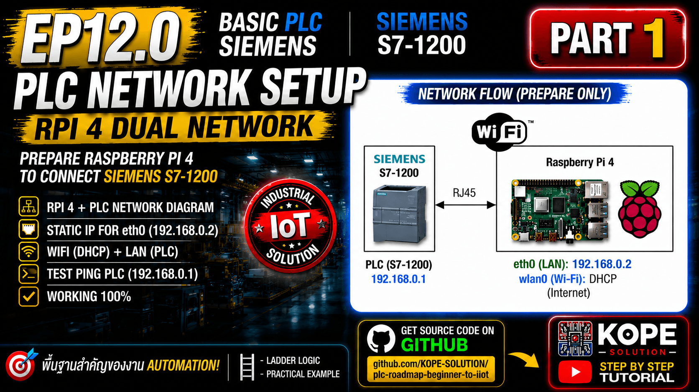
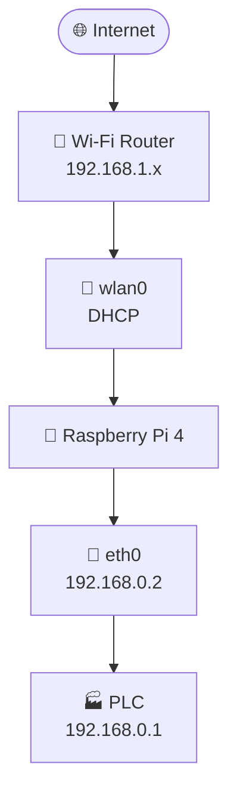
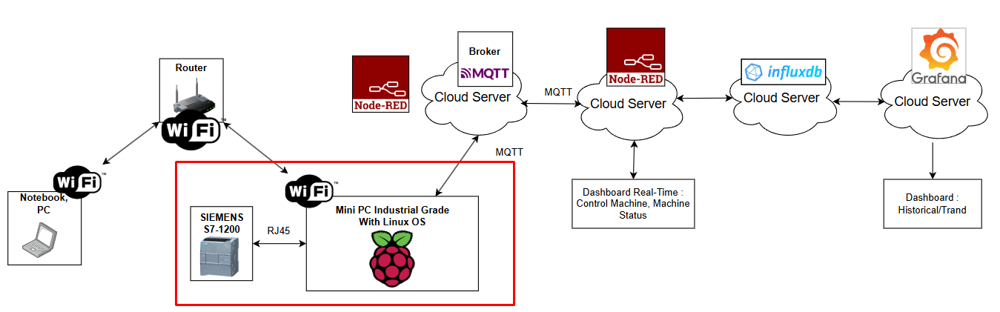

# Raspberry Pi with PLC (Dual Network)



> Raspberry Pi 4 + PLC + Wi‑Fi Internet + Ethernet PLC Network

## Architecture





## Step 1: Flash Raspberry Pi OS Lite

Use Raspberry Pi Imager.

Recommended OS: `Raspberry Pi OS Lite (64-bit)`

### Advanced Options (Ctrl+Shift+X)

Configure: 
- Hostname: PI-PLC0001-FACTORY001 
- Username: pi0001 
- Password: pi0001 
- Enable SSH 
- Configure Wi‑Fi SSID / Password 
- Timezone: Asia/Bangkok

> Raspberry Pi Imager cannot configure a static IP for LAN (eth0).
> Configure it after first boot.

## Step 2: Boot Raspberry Pi

Insert SD card and power on.

## Step 3: SSH

``` bash
ssh pi0001@192.168.1.124
```

## Step 4: Update

``` bash
sudo apt update
sudo apt upgrade -y
```

## Step 5: Check Network

``` bash
ip addr
```

## Step 6: Configure PLC Ethernet

``` bash
nmcli con show
```

``` bash
sudo nmcli con modify netplan-eth0 ipv4.addresses 192.168.0.2/24
sudo nmcli con modify netplan-eth0 ipv4.method manual
sudo nmcli con modify netplan-eth0 ipv4.never-default yes
sudo nmcli con down netplan-eth0
sudo nmcli con up netplan-eth0
```

## Step 7: Verify

``` bash
ip addr show eth0
ping 192.168.0.1
```

Success: `64 bytes from 192.168.0.1`
