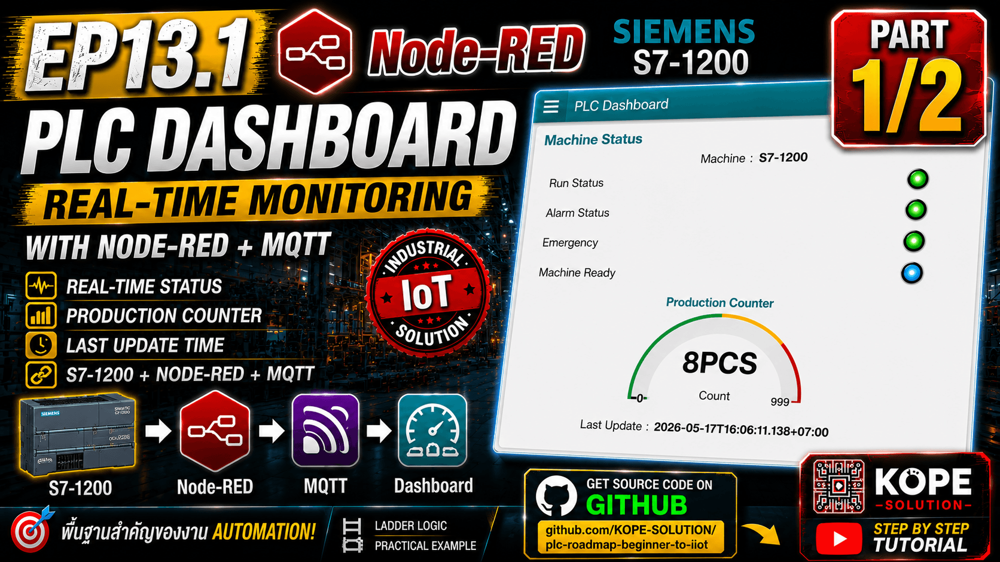
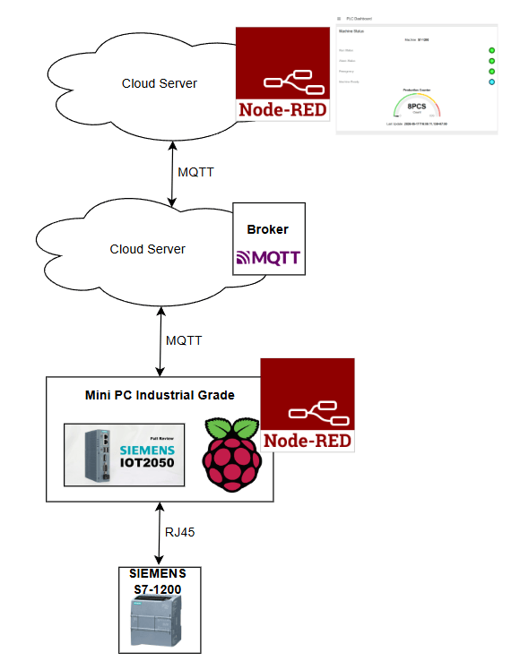
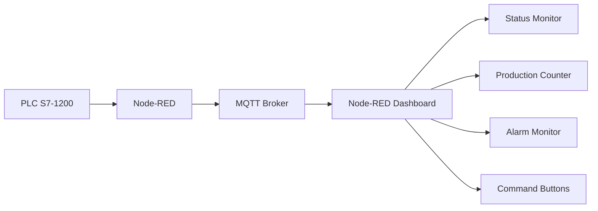
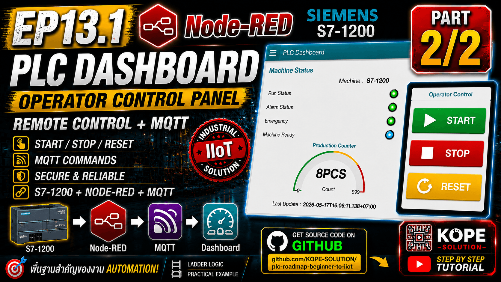

# EP13 — PLC Dashboard with Node-RED

This episode introduces a real-time PLC dashboard using Node-RED.

The dashboard displays PLC machine data that was already published to MQTT in EP12.



---

## Main Goal

Build a dashboard that can monitor Siemens S7-1200 PLC status in real time.



---

# Topics
- PLC Dashboard
- Node-RED Dashboard
- MQTT Status Monitoring
- Real-time Machine Status
- Production Counter Display
- Alarm / Emergency Monitoring
- Operator Command Buttons

---

## Ladder Logic

EP13 uses the same PLC Ladder Logic from EP12.

No new PLC Ladder Logic is required in this episode.

The PLC already exposes data through DB100.

---

## DB100 Data

| Tag                  | Address      | Description        |
| -------------------- | ------------ | ------------------ |
| PLC_Run_Status       | DB100.DBX0.3 | Machine Running    |
| PLC_Alarm_Status     | DB100.DBX0.4 | Alarm Active       |
| PLC_Emergency_Status | DB100.DBX0.5 | Emergency Active   |
| PLC_Ready_Status     | DB100.DBX0.6 | Machine Ready      |
| PLC_Production_Count | DB100.DBW2   | Production Counter |


---

## MQTT Status Topic

`factory/plc/s7-1200/status`

Example payload:

```json
{
  "machine": "S7-1200",
  "timestamp": "2026-05-16T23:04:03.260+07:00",
  "timezone": "Asia/Bangkok",
  "run": false,
  "alarm": false,
  "emergency": false,
  "ready": true,
  "count": 0
}
```

---

## MQTT Command Topics

```sh
factory/plc/s7-1200/cmd/start
factory/plc/s7-1200/cmd/stop
factory/plc/s7-1200/cmd/reset
```

---

## System Architecture



---

## Step-by-Step Lab

### Step 1 — Confirm EP12 is Working

Make sure MQTT Explorer can receive: `factory/plc/s7-1200/status` and can publish commands to:

```sh
factory/plc/s7-1200/cmd/start
factory/plc/s7-1200/cmd/stop
factory/plc/s7-1200/cmd/reset
```

### Step 2 — Install Node-RED Dashboard

In Node-RED: `Menu → Manage palette → Install`

Install: `node-red-dashboard` or: `@flowfuse/node-red-dashboard`

### Step 3 — Create Dashboard Tab

Create a dashboard tab: `PLC Dashboard`

Create groups:

```sh
Machine Status
Production
Operator Command
```

### Step 4 — Subscribe MQTT Status

Add MQTT In node:

```sh
Topic:
factory/plc/s7-1200/status
```

Output: `auto-detect`


### Step 5 — Parse JSON

If payload is a string, add JSON node.

If payload is already an object, JSON node is not required.

### Step 6 — Prepare Dashboard Data

Add Function node: `Prepare Dashboard Data`

Set Function Outputs:

```text
7 Outputs
```

Use this code:

```js
const data = msg.payload;

return [
    { payload: data.machine },      // Output 1
    { payload: data.run },          // Output 2
    { payload: data.alarm },        // Output 3
    { payload: data.emergency },    // Output 4
    { payload: data.ready },        // Output 5
    { payload: data.count },        // Output 6
    { payload: data.timestamp }     // Output 7
];
```

---

### Step 7 — Add Dashboard Widgets

Create Dashboard Group:

```text
[PLC Dashboard] Machine Status
```

Connect Function outputs to Dashboard widgets:

| Output | Widget Type | Widget Name |
| ------ | ------------ | ------------ |
| 1 | ui-text | Machine Name |
| 2 | ui-led | Run LED |
| 3 | ui-led | Alarm LED |
| 4 | ui-led | Emergency LED |
| 5 | ui-led | Ready LED |
| 6 | ui-gauge | Production Counter |
| 7 | ui-text | Last Update |


### Step 8 — Add Operator Buttons



Create three dashboard buttons for machine control.

These buttons will publish MQTT commands from the dashboard to Node-RED and PLC.

| Button | MQTT Topic                      | Payload |
| ------ | ------------------------------- | ------- |
| Start  | `factory/plc/s7-1200/cmd/start` | `1`     |
| Stop   | `factory/plc/s7-1200/cmd/stop`  | `1`     |
| Reset  | `factory/plc/s7-1200/cmd/reset` | `1`     |


#### Dashboard Button Configuration
PLC Start Button

| Setting      | Value                           |
| ------------ | ------------------------------- |
| Label        | `Start`                         |
| Payload Type | `number`                        |
| Payload      | `1`                             |
| Topic Type   | `string`                        |
| Topic        | `factory/plc/s7-1200/cmd/start` |

Recommended style:
- Background: `#16a34a`

<br>

PLC Stop Button

| Setting      | Value                          |
| ------------ | ------------------------------ |
| Label        | `Stop`                         |
| Payload Type | `number`                       |
| Payload      | `1`                            |
| Topic Type   | `string`                       |
| Topic        | `factory/plc/s7-1200/cmd/stop` |


Recommended style:
- Background: `#dc2626`

<br>

PLC Reset Button

| Setting      | Value                           |
| ------------ | ------------------------------- |
| Label        | `Reset`                         |
| Payload Type | `number`                        |
| Payload      | `1`                             |
| Topic Type   | `string`                        |
| Topic        | `factory/plc/s7-1200/cmd/reset` |

Recommended style:
- Background: `#eab308`

<br>

### Connect Buttons to MQTT Output

Connect all dashboard buttons to a single MQTT OUT node.

```sh
[PLC Start] ─┐
[PLC Stop ] ─┼──> [MQTT OUT]
[PLC Reset] ─┘
```

MQTT OUT Configuration

eave Topic field empty.

Node-RED will automatically use: `msg.topic` from each dashboard button.


### Step 9 — Test Dashboard

Expected results:

| Action       | Dashboard Result                     |
| ------------ | ------------------------------------ |
| PLC Ready    | Ready = READY                        |
| Start        | Run = RUNNING                        |
| Stop         | Run = STOPPED                        |
| Emergency    | Emergency = EMERGENCY, Alarm = ALARM |
| Reset        | Alarm = NORMAL                       |
| Count Change | Gauge value changes                  |


---

## Important Industrial Concept

Dashboard is a visualization and operator interface.

The dashboard should not bypass PLC safety logic.

```sh
Dashboard → MQTT Command → Node-RED → PLC Command Bit
```

The PLC still decides if the command is allowed.

---

## Learning Outcome

After this EP, you should understand:
- How to build a real-time PLC dashboard
- How to subscribe PLC data from MQTT
- How to display Run / Alarm / Emergency / Ready status
- How to show production counter
- How to send Start / Stop / Reset commands from dashboard
- Why PLC safety logic must remain inside PLC

---

## Key Idea
- PLC controls the machine.
- MQTT carries the data.
- Node-RED Dashboard visualizes and operates the system.