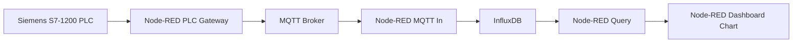

# EP13.2 — PLC Node-RED + InfluxDB Trend Dashboard

EP13.2 นี้ปรับแผนจากเดิมที่ตั้งใจทำ **Grafana Dashboard** มาเป็นแนวทางใหม่:

> **PLC / MQTT → Node-RED → InfluxDB → Node-RED Dashboard**

เป้าหมายคือให้ Node-RED ทำได้ทั้ง 2 บทบาทในตอนเดียว:

1. รับข้อมูล PLC จาก MQTT แล้วบันทึกลง InfluxDB
2. Query ข้อมูลย้อนหลังจาก InfluxDB แล้วนำมาแสดงเป็น Trend / Chart บน Node-RED Dashboard

Grafana จะถูกเลื่อนไปทำใน **EP13.3** หรือใช้ต่อยอดจาก EP13.2 ในอนาคต

---

## Episode Concept

ใน EP13.1 เราทำ Node-RED Dashboard แบบ Real-time แล้ว

ใน EP13.2 เราจะเพิ่มความสามารถเรื่อง **Historical Data** หรือข้อมูลย้อนหลัง โดยใช้ InfluxDB เป็น Time-Series Database



---

## Why This EP Comes Before Grafana

การทำ Grafana จะเข้าใจง่ายขึ้นมาก ถ้าเรามีข้อมูลอยู่ใน InfluxDB ก่อนแล้ว

ดังนั้น EP13.2 จะเน้นวางรากฐานสำคัญ:

| Layer | Tool | Role |
|---|---|---|
| Data Source | PLC / MQTT | ส่งสถานะเครื่องจักร |
| Flow / Pipeline | Node-RED | รับข้อมูล แปลงข้อมูล และเขียนลง InfluxDB |
| Database | InfluxDB | เก็บข้อมูลย้อนหลังแบบ Time-Series |
| Dashboard | Node-RED Dashboard | แสดง Real-time + Trend ย้อนหลัง |
| Future Dashboard | Grafana | ใช้ต่อยอดใน EP13.3 |

---

## MQTT Status Topic

```text
factory/plc/s7-1200/status
```

Example payload:

```json
{
  "machine": "S7-1200",
  "timestamp": "2026-05-16T23:04:03.260+07:00",
  "timezone": "Asia/Bangkok",
  "run": false,
  "alarm": false,
  "emergency": false,
  "ready": true,
  "count": 0
}
```

---

## InfluxDB Measurement Design

ใช้ measurement ชื่อ:

```text
plc_status
```

### Tags

| Tag | Example | Purpose |
|---|---|---|
| machine | S7-1200 | แยกเครื่องจักร / PLC |
| source | mqtt | ระบุแหล่งข้อมูล |

### Fields

| Field | Type | Meaning |
|---|---:|---|
| run | int | 1 = Running, 0 = Stop |
| alarm | int | 1 = Alarm Active |
| emergency | int | 1 = Emergency Active |
| ready | int | 1 = Ready |
| count | int | Production Counter |

> หมายเหตุ: ค่าประเภท boolean แนะนำให้แปลงเป็น 0/1 ก่อนบันทึก เพื่อให้นำไปวาดกราฟ Trend ได้ง่าย

---

## Folder Structure

```text
EP13.2-PLC-NodeRED-InfluxDB-Trend-Dashboard/
├── README.md
├── part-1-mqtt-to-influxdb/
│   └── README.md
├── part-2-influxdb-to-nodered-dashboard/
│   └── README.md
├── nodered/
│   ├── flow-part1-mqtt-to-influxdb.json
│   └── flow-part2-query-influxdb-dashboard.json
└── docs/
    └── industrial-safety-note.md
```

---

## Required Node-RED Nodes

Install from **Manage palette → Install**:

```text
node-red-contrib-influxdb
node-red-dashboard
```

หรือถ้าใช้ Dashboard รุ่นใหม่:

```text
@flowfuse/node-red-dashboard
```

---

## EP13.2 Part 1/2 — MQTT to InfluxDB

Goal:

```text
Subscribe MQTT status → Convert JSON → Prepare InfluxDB Point → Write to InfluxDB
```

Flow file:

```text
nodered/flow-part1-mqtt-to-influxdb.json
```

Learning outcome:

- เข้าใจโครงสร้าง payload จาก PLC
- แปลง boolean เป็น numeric 0/1
- ออกแบบ measurement / tags / fields
- บันทึกข้อมูล PLC ลง InfluxDB ได้

---

## EP13.2 Part 2/2 — Query InfluxDB to Node-RED Dashboard

Goal:

```text
Inject / Refresh Button → Query InfluxDB → Format Chart Data → Show Trend in Node-RED Dashboard
```

Flow file:

```text
nodered/flow-part2-query-influxdb-dashboard.json
```

Learning outcome:
- Query ข้อมูลย้อนหลังจาก InfluxDB
- แสดง Production Count Trend
- แสดง Run / Alarm / Ready Trend
- ใช้ Node-RED Dashboard เป็น Historical Dashboard แบบง่าย

---

## Example Flux Query

ตัวอย่าง Query สำหรับ InfluxDB 2.x:

```flux
from(bucket: "plc_data")
  |> range(start: -1h)
  |> filter(fn: (r) => r._measurement == "plc_status")
  |> filter(fn: (r) => r._field == "count")
  |> aggregateWindow(every: 10s, fn: last, createEmpty: false)
  |> yield(name: "count")
```

---

## Recommended Dashboard Widgets

| Widget | Data | Purpose |
|---|---|---|
| Text | Last Update | ดูเวลาข้อมูลล่าสุด |
| Gauge | Production Count | ดูค่าปัจจุบัน |
| Chart | Count Trend | ดูแนวโน้มการผลิตย้อนหลัง |
| Chart | Run Status Trend | ดูช่วงเวลาที่เครื่อง Run / Stop |
| Chart | Alarm Trend | ดูช่วงเวลาที่ Alarm เกิดขึ้น |

---

## What Not to Do in EP13.2

เพื่อไม่ให้ตอนนี้ยาวและซับซ้อนเกินไป EP13.2 จะยังไม่ทำ Grafana ก่อน

ยังไม่ทำ:
- Grafana Data Source
- Grafana Panel
- Grafana Alert
- Grafana Control Panel

สิ่งเหล่านี้เหมาะมากสำหรับ **EP13.3**

---

## Safety Note

Dashboard ใช้สำหรับ Monitoring และ Operator Interface ระดับทดลองเท่านั้น

คำสั่งควบคุมเครื่องจักรจริง เช่น Start / Stop / Reset ต้องผ่าน PLC Logic, Interlock และ Safety Circuit เสมอ
