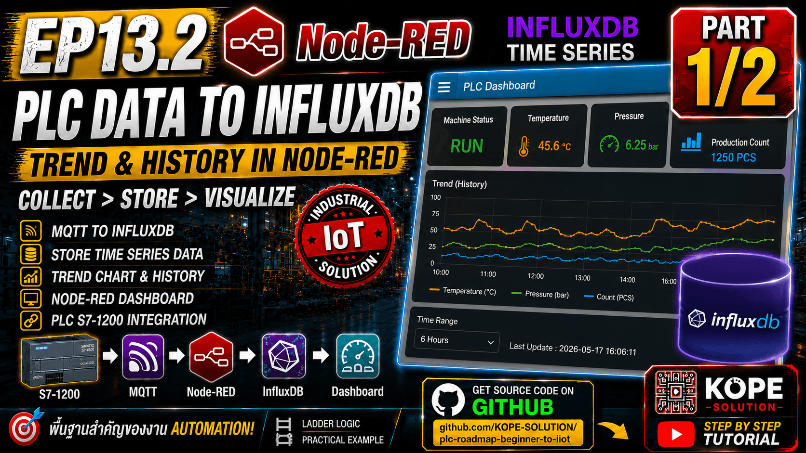

# EP13.2 Part 1/2 — MQTT to InfluxDB

## Goal

รับข้อมูลสถานะ PLC จาก MQTT แล้วบันทึกลง InfluxDB เพื่อใช้เป็นข้อมูลย้อนหลัง

```text
MQTT Status → Node-RED → InfluxDB
```




---

## Input MQTT Topic

```text
factory/plc/s7-1200/status
```

---

## Function Node: Prepare InfluxDB Point

```js
const data = msg.payload;

msg.measurement = "plc_status";

msg.payload = {
  run: data.run ? 1 : 0,
  alarm: data.alarm ? 1 : 0,
  emergency: data.emergency ? 1 : 0,
  ready: data.ready ? 1 : 0,
  count: Number(data.count || 0)
};

return msg;
```

---

## InfluxDB Config Example

| Setting | Value |
|---|---|
| URL | `http://localhost:8086` |
| Organization | your org name |
| Bucket | `plc_data` |
| Token | your InfluxDB token |

---

## Test Checklist

- MQTT Explorer เห็นข้อมูลที่ topic `factory/plc/s7-1200/status`
- Node-RED debug เห็น payload เป็น object
- InfluxDB bucket `plc_data` มี measurement `plc_status`
- Field `count`, `run`, `alarm`, `ready`, `emergency` ถูกบันทึกเป็นตัวเลข
