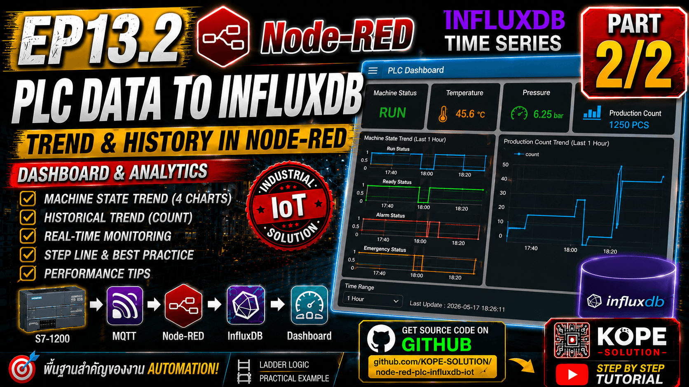
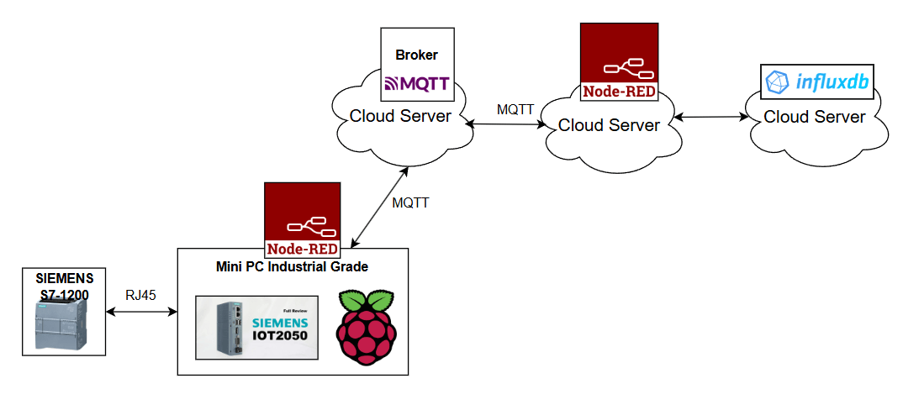
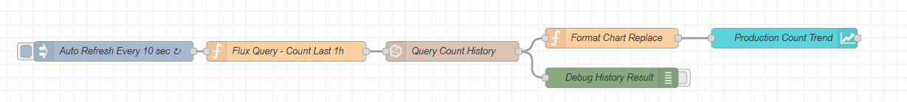
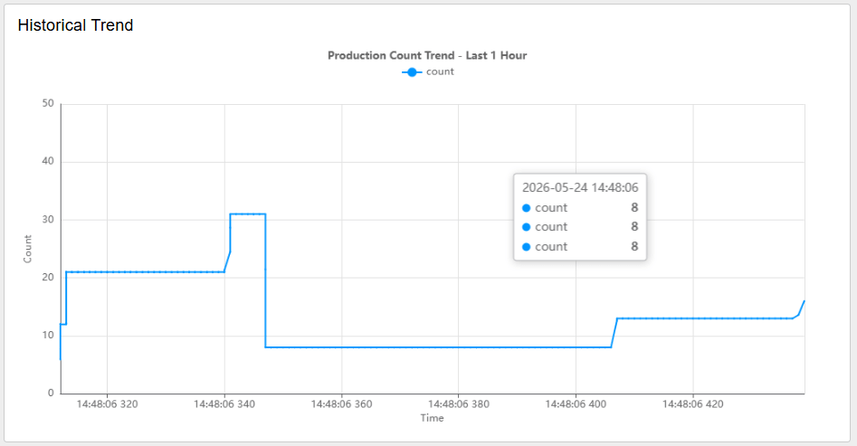
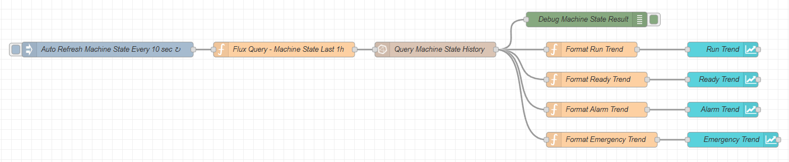
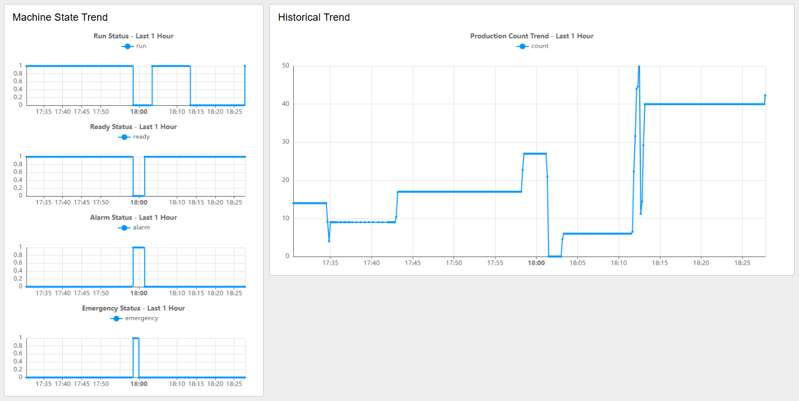

# EP13.2 Part 2/2 — InfluxDB to Node-RED Dashboard

## Goal

ดึงข้อมูลย้อนหลังจาก InfluxDB แล้วแสดง Trend บน Node-RED Dashboard



```text
InfluxDB → Node-RED Query → Dashboard Chart
```



---

## Suggested Dashboard Layout

| Group | Widget | Purpose |
|---|---|---|
| Current Status | Text / LED / Gauge | แสดงค่าปัจจุบันจาก MQTT |
| Historical Trend | Chart | แสดง Count ย้อนหลัง |
| Machine State Trend | Chart | แสดง Run / Alarm / Ready ย้อนหลัง |

---

## Flow for Historical Trend : Step by Step



### 1. Inject Node

Node: `inject`

Name: `Auto Refresh Every 30 sec`

Repeat: `interval every 30 seconds`

Once: `enabled`

Once delay: `2 seconds`

### 2. Function: Flux Query

node: `function`
Name: `Flux Query - Count Last 1h`
Code:
```js
msg.query = `from(bucket: "plc_data")
  |> range(start: -1h)
  |> filter(fn: (r) => r._measurement == "plc_status")
  |> filter(fn: (r) => r._field == "count")
  |> aggregateWindow(every: 10s, fn: last, createEmpty: false)
  |> yield(name: "count_trend")`;

return msg;
```

### 3. InfluxDB In Node

Node: `influxdb in`
Name: `Query Count History`
Server: `Real Time Database`
Organization: `kope-solution`

> ช่อง Query ปล่อยว่างไว้ เพราะเราใช้ `msg.query`

### 4. Function: Format Chart

Node: `function`
Name: `Format Chart Replace`
Code:
```js
let rows = msg.payload || [];

rows.sort((a, b) => {
    return new Date(a._time).getTime() - new Date(b._time).getTime();
});

msg.topic = "count";

msg.payload = rows.map(r => ({
    x: new Date(r._time).getTime(),
    y: Number(r._value)
}));

return msg;
```

### 5. Dashboard 2 Chart

Node: `dashboard 2 → chart`

Name: `Production Count Trend`

Label: `Production Count Trend - Last 1 Hour`

Type: `Line`

Interpolation: `Linear`

Action: `Replace`

Series: `msg.topic`

X-Axis Type: `Timescale`

X: `key x`

Y: `key y`

Y min: `0`

Y max: `999`

Remove older: `1 Hours`

### 6. Wire flow

```sh
Auto Refresh Every 10 sec
→ Flux Query - Count Last 1h
→ Query Count History
→ Format Chart Replace
→ Production Count Trend
```



---

## Flow for Machine State Trend : Step by Step

Machine State Trend ใช้สำหรับดูสถานะของเครื่องจักรย้อนหลัง เช่น Run, Alarm, Ready และ Emergency

```text
InfluxDB → Node-RED Query → Format Multi-Series → Dashboard Chart
```



### 1.Inject Node

Node: `inject`

Name: `Auto Refresh Machine State Every 30 sec`

Repeat: `interval every 30 seconds`

Once: `enabled`

Once delay: `3 seconds`

### 2. Function: Flux Query Machine State

Node: `function`

Name: `Flux Query - Machine State Last 1h`

Code:
```js
msg.query = `from(bucket: "plc_data")
  |> range(start: -1h)
  |> filter(fn: (r) => r._measurement == "plc_status")
  |> filter(fn: (r) =>
      r._field == "run" or
      r._field == "alarm" or
      r._field == "ready" or
      r._field == "emergency"
  )
  |> aggregateWindow(every: 30s, fn: last, createEmpty: false)
  |> yield(name: "machine_state_trend")`;

return msg;
```

### 3. InfluxDB In Node

Node: `influxdb in`

Name: `Query Machine State History`

Server: `Real Time Database`

Organization: `kope-solution`

> ช่อง Query ปล่อยว่างไว้ เพราะเราใช้ msg.query

### 4. Function: Format Machine State Chart

หลังจาก Query Machine State แล้ว ให้แยกข้อมูลออกเป็น 4 Function ตาม field แต่ละตัว

```text
Query Machine State History
├── Format Run Trend
├── Format Ready Trend
├── Format Alarm Trend
└── Format Emergency Trend
```

<br>

4.1 Function: Format Run Trend

Node: `function`

Name: `Format Run Trend`

Code:
```js
let rows = msg.payload || [];

rows = rows.filter(r => r._field === "run");

rows.sort((a, b) => {
    return new Date(a._time).getTime() - new Date(b._time).getTime();
});

msg.topic = "run";

msg.payload = rows.map(r => ({
    x: new Date(r._time).getTime(),
    y: Number(r._value)
}));

return msg;
```

<br>

4.2 Function: Format Ready Trend

Node: `function`

Name: `Format Ready Trend`

Code:

```js
let rows = msg.payload || [];

rows = rows.filter(r => r._field === "ready");

rows.sort((a, b) => {
    return new Date(a._time).getTime() - new Date(b._time).getTime();
});

msg.topic = "ready";

msg.payload = rows.map(r => ({
    x: new Date(r._time).getTime(),
    y: Number(r._value)
}));

return msg;
```

<br>

4.3 Function: Format Alarm Trend

Node: `function`

Name: `Format Alarm Trend`

Code:

```js
let rows = msg.payload || [];

rows = rows.filter(r => r._field === "alarm");

rows.sort((a, b) => {
    return new Date(a._time).getTime() - new Date(b._time).getTime();
});

msg.topic = "alarm";

msg.payload = rows.map(r => ({
    x: new Date(r._time).getTime(),
    y: Number(r._value)
}));

return msg;
```

<br>

4.4 Function: Format Emergency Trend

Node: `function`

Name: `Format Emergency Trend`

Code:

```js
let rows = msg.payload || [];

rows = rows.filter(r => r._field === "emergency");

rows.sort((a, b) => {
    return new Date(a._time).getTime() - new Date(b._time).getTime();
});

msg.topic = "emergency";

msg.payload = rows.map(r => ({
    x: new Date(r._time).getTime(),
    y: Number(r._value)
}));

return msg;
```

### 5. Dashboard 2 Charts

ให้สร้าง Chart ทั้งหมด 4 ตัว

| Chart Name        | Label                            |
| ----------------- | -------------------------------- |
| `Run Trend`       | `Run Status - Last 1 Hour`       |
| `Ready Trend`     | `Ready Status - Last 1 Hour`     |
| `Alarm Trend`     | `Alarm Status - Last 1 Hour`     |
| `Emergency Trend` | `Emergency Status - Last 1 Hour` |

ตั้งค่า Chart ทุกตัวเหมือนกันดังนี้:

Node: `dashboard 2 → chart`

Type: `Line`

Interpolation: `Step`

Action: `Replace`

Series: `msg.topic`

X-Axis Type: `Timescale`

X: `key x`

Y: `key y`

Y min: `0`

Y max: `1`

Remove older: `1 Hours`



---

### Machine State Trend Meaning

| Field     | Meaning           | Value                     |
| --------- | ----------------- | ------------------------- |
| run       | เครื่องกำลังทำงาน | 0 = OFF, 1 = ON           |
| alarm     | Alarm Status      | 0 = Normal, 1 = Alarm     |
| ready     | Machine Ready     | 0 = Not Ready, 1 = Ready  |
| emergency | Emergency Status  | 0 = Normal, 1 = Emergency |

> กราฟนี้เหมาะสำหรับดูช่วงเวลาที่เครื่อง Run, Alarm, Ready หรือ Emergency ย้อนหลัง

---

# Recommended Refresh Rate for Dashboard

| Refresh | Grafana | Node-RED Dashboard |
|---|---|---|
| 1 sec | พอไหว | เริ่มหนัก |
| 5 sec | สบาย | เริ่มกิน CPU |
| 10 sec | สบายมาก | พอได้ |
| 30 sec | ดีมาก | ดี |
| 1 min | production | production |

---

## Notes

- Node-RED Dashboard เหมาะสำหรับ Lab, Demo และ Small HMI
- Grafana เหมาะสำหรับ Historical Trend และ Production Monitoring
- การ Query Time-Series Database ถี่เกินไป อาจทำให้ CPU และ Database Load สูงขึ้น
- สำหรับ Production จริง แนะนำ:
  - MQTT → Real-time Status
  - InfluxDB → Historical Trend
  - Grafana → Monitoring Dashboard

---

## Teaching Point

Node-RED Dashboard เหมาะมากสำหรับการสอน เพราะเห็นทั้ง Flow, Data Pipeline และ Dashboard ในเครื่องมือเดียว

Grafana เหมาะสำหรับตอนถัดไป เมื่อข้อมูลถูกจัดเก็บใน InfluxDB เรียบร้อยแล้ว
