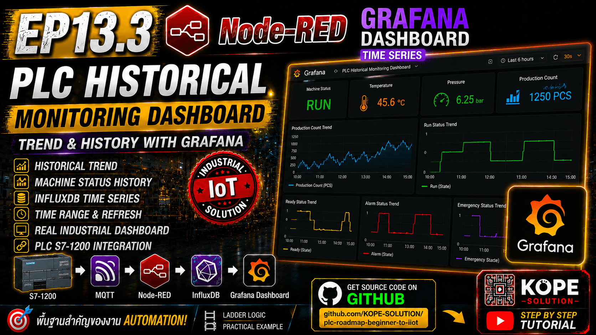
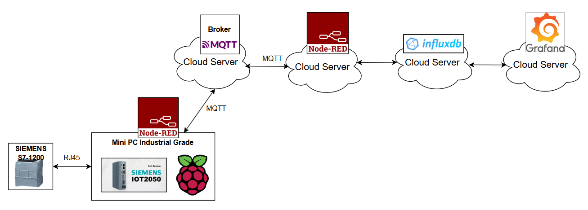
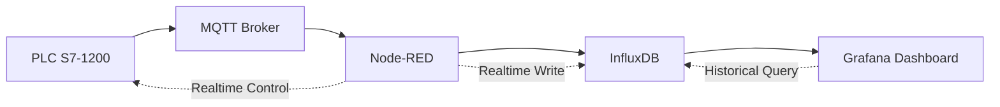
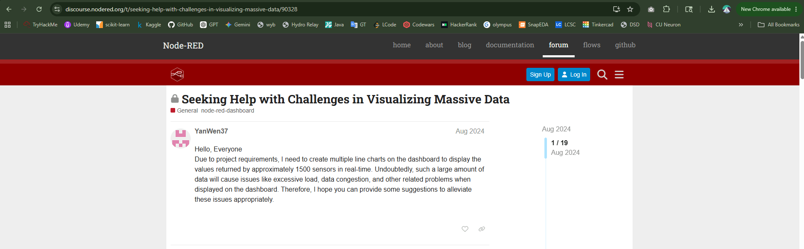
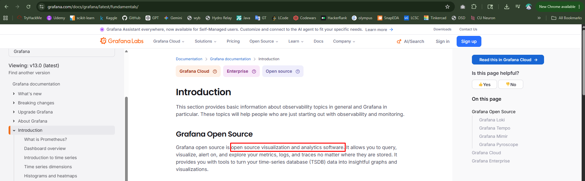

# EP13.3 — Grafana Dashboard for PLC Historical Monitoring



## Goal

สร้าง Historical Dashboard ด้วย Grafana สำหรับงาน Industrial IoT และ PLC Monitoring โดยใช้ข้อมูลจาก InfluxDB

เหมาะสำหรับ:
- Production Monitoring
- Historical Trend
- Machine Status History
- Industrial Historian
- Long-term Data Visualization



---

## What You Will Learn

ใน EP นี้จะได้เรียนรู้:
- เชื่อมต่อ Grafana กับ InfluxDB
- สร้าง Historical Dashboard
- แสดง Production Count Trend
- แสดง Machine Status History
- ใช้งาน Time Series Panel
- ตั้งค่า Refresh Rate
- Grafana Architecture
- Grafana vs Node-RED Dashboard
- แนวทางใช้งานจริงในระบบ Industrial IoT

---

## system Architecture



---

## Industrial Architecture Concept

### Realtime Layer

```sh
PLC ↔ Node-RED Dashboard
```

- Real-time Status
- Machine Control
- Start / Stop / Reset
- MQTT Automation
- Realtime Widget

Reference : https://discourse.nodered.org/t/seeking-help-with-challenges-in-visualizing-massive-data/90328



### Historical Layer

```sh
InfluxDB ↔ Grafana
```

- Historical Monitoring
- Trend Analysis
- Production Dashboard
- Long-term Visualization
- Industrial Historian

Reference : https://grafana.com/docs/grafana/latest/fundamentals/



---

## Why Grafana?

Grafana เหมาะกับงานต่างๆ ดังนี้
- Historical Dashboard
- Time-Series Visualization
- Large Data Monitoring
- Industrial Historian
- Production Monitoring
- Multi-Device Dashboard
- Low CPU Rendering
- Large History Query

---

## Why NOT Use Grafana for Main Control?

Grafana ถูกออกแบบมาสำหรับ
- Visualization
- Historical Query
- Dashboard Rendering

<br>

ไม่ได้ถูกออกแบบมาเพื่อ
- Realtime Machine Control
- PLC Start/Stop Safety
- Industrial Interlock
- Realtime Automation Logic

<br>

ดังนั้นในงานจริงนิยมแยกหน้าที่ดังนี้
| Tool     | Main Role                       |
| -------- | ------------------------------- |
| PLC      | Machine Control                 |
| Node-RED | Realtime Logic + MQTT + Control |
| InfluxDB | Historical Database             |
| Grafana  | Historical Dashboard            |

---

## Step 1 — Open Grafana

Example: `http://localhost:3000`

Default Login:

```sh
Username: admin
Password: admin
```

---

## Step 2 — Add InfluxDB Data Source

```sh
Connections
→ Data Sources
→ Add new data source
→ InfluxDB
```

---

## Step 3 — Configure InfluxDB

Query Language : `Flux`

URL : `http://192.168.1.2:8086` (Example)

<br>

Auth Settings
| Option           | Value |
| ---------------- | ----- |
| Basic auth       | OFF   |
| With Credentials | OFF   |
| TLS Client Auth  | OFF   |
| Skip TLS Verify  | OFF   |

<br>

InfluxDB Details
| Field             | Value                   |
| ----------------- | ----------------------- |
| Organization      | kope-solution           |
| Token             | Your InfluxDB API Token |
| Default Bucket    | plc_data                |
| Min time interval | 10s                     |

---

## Step 4 — Test Connection

กด: `Save & Test`

ถ้าสำเร็จจะขึ้น: `Data source is working`

---

## Step 5 — Create Dashboard

```sh
Dashboards
→ New Dashboard

→ Add
→ Panel

→ Configure visualization
```

Dashboard Name : `PLC Historical Monitoring Dashboard`

Data Source : `influxdb`

---

## Step 6 — Production Count Trend

Flux Query

```flux
from(bucket: "plc_data")
  |> range(start: -1h)
  |> filter(fn: (r) => r._measurement == "plc_status")
  |> filter(fn: (r) => r._field == "count")
  |> aggregateWindow(every: 10s, fn: mean, createEmpty: false)
  |> yield(name: "count_trend")
```

<br>

Recommended Panel Settings

| Setting    | Value                  |
| ---------- | ---------------------- |
| Panel Type | Time Series            |
| Title      | Production Count Trend |
| Legend     | Bottom                 |
| Time zone  | Asia/Bangkok           |
| Line Width | 2                      |
| Unit       | none                   |
| Min        | 0                      |
| Refresh    | 30 sec                 |

### Why Use `mean` for Production Count?

Production Count เป็นค่าตัวเลขต่อเนื่อง ดังนั้นจึงเหมาะกับ: `fn: mean` ซึ่งจะมีข้อดี ดังนี้
- ลด noise
- ลด query load
- ทำให้กราฟ smooth
- เหมาะกับ historical trend

---

## Step 7 — Run Status Trend

Flux Query

```flux
from(bucket: "plc_data")
  |> range(start: -1h)
  |> filter(fn: (r) => r._measurement == "plc_status")
  |> filter(fn: (r) => r._field == "run")
  |> aggregateWindow(every: 30s, fn: last, createEmpty: false)
  |> yield(name: "run_trend")
```

<br>

Recommended Panel Settings

| Setting    | Value            |
| ---------- | ---------------- |
| Panel Type | Time Series      |
| Title      | Run Status Trend |
| Line Style | Step             |
| Min        | 0                |
| Max        | 1                |

<br>

### Why Use last for Machine Status?

Machine Status เป็น Digital State:
```sh
0 = OFF
1 = ON
```

ดังนั้น: `fn: last` จะเหมาะกว่า `mean` เพราะต้องการให้
- ค่า state ล่าสุด
- ไม่เฉลี่ยค่า
- แสดง ON/OFF ได้ถูกต้อง

---

## Step 8 — Ready Status Trend

Flux Query

```flux
from(bucket: "plc_data")
  |> range(start: -1h)
  |> filter(fn: (r) => r._measurement == "plc_status")
  |> filter(fn: (r) => r._field == "ready")
  |> aggregateWindow(every: 30s, fn: last, createEmpty: false)
  |> yield(name: "ready_trend")
```

---

## Step 9 — Alarm Status Trend

Flux Query

```flux
from(bucket: "plc_data")
  |> range(start: -1h)
  |> filter(fn: (r) => r._measurement == "plc_status")
  |> filter(fn: (r) => r._field == "alarm")
  |> aggregateWindow(every: 30s, fn: last, createEmpty: false)
  |> yield(name: "alarm_trend")
```

---

## Step 10 — Emergency Status Trend

Flux Query

```flux
from(bucket: "plc_data")
  |> range(start: -1h)
  |> filter(fn: (r) => r._measurement == "plc_status")
  |> filter(fn: (r) => r._field == "emergency")
  |> aggregateWindow(every: 30s, fn: last, createEmpty: false)
  |> yield(name: "emergency_trend")
```

Recommended Refresh Rate
| Refresh | Grafana    | Node-RED Dashboard |
| ------- | ---------- | ------------------ |
| 1 sec   | พอไหว      | เริ่มหนัก          |
| 5 sec   | สบาย       | เริ่มกิน CPU       |
| 10 sec  | สบายมาก    | พอได้              |
| 30 sec  | ดีมาก      | ดี                 |
| 1 min   | production | production         |

---

## Why Grafana Feels Faster

### Grafana
- ถูกออกแบบมาสำหรับงาน Time-Series โดยเฉพาะ
- Render Dashboard แยกเป็น Panel
- มีระบบ Query Cache
- จัดการ Historical Data ปริมาณมากได้ดีกว่า
- ประสิทธิภาพในการ Render Dashboard สูง

<br>

### Node-RED Dashboard
- เหมาะกับ Realtime Widget
- UI มีความ Lightweight
- เหมาะกับงาน Control Panel
- เหมาะกับ Realtime Interaction

---

## คำแนะนำสำหรับ Realtime Control

### Recommended Realtime Architecture
```sh
PLC
↕
Node-RED Dashboard
```

เหมาะสำหรับ:
- Start / Stop
- แสดงสถานะแบบ Realtime
- Alarm Acknowledge
- MQTT Realtime Control
- Control Widget

---

## คำแนะนำสำหรับ Historical Dashboard

### Recommended Historical Architecture
```sh
InfluxDB
↕
Grafana
```

เหมาะสำหรับ:
- Historical Trend
- วิเคราะห์สถานะเครื่องจักร
- Production Dashboard
- Historical Query
- Long-term Monitoring

---

## เปรียบเทียบ — เครื่องมือไหนเหมาะกับอะไร

| Platform                      | Historical Dashboard | Realtime Control  | MQTT Support              | Modern UI         | Complexity    | Recommended Usage                 |
| ----------------------------- | -------------------- | ----------------- | ------------------------- | ----------------- | ------------- | --------------------------------- |
| Grafana                       | ดีมาก                | จำกัดด้าน Control | พื้นฐาน (ผ่าน Plugin/API) | ดีมาก             | ปานกลาง       | Historical Dashboard / Analytics  |
| Node-RED Dashboard            | พื้นฐาน              | ดีมาก             | ดีมาก                     | พื้นฐาน           | ง่าย          | Realtime Dashboard / MQTT Control |
| RapidSCADA                    | ดีมาก                | ดีมาก             | ดี                        | พื้นฐานถึงปานกลาง | สูง           | Industrial SCADA                  |
| FUXA                          | ดีมาก                | ดีมาก             | ดีมาก                     | ดีมาก             | ปานกลางถึงสูง | Web SCADA / Industrial HMI        |
| ThingsBoard Community Edition | ดีมาก                | ดีมาก             | ดีมาก                     | ดีมาก             | สูง           | Industrial IoT Platform           |
| ReactJS Web App               | ดีมาก                | ดีมาก             | ดีมาก                     | ดีมาก             | สูงมาก        | Custom Web Platform               |
| Desktop App (C#/Python)       | ดีมาก                | ดีมาก             | ดี                        | ปานกลาง           | สูง           | Dedicated Industrial Application  |

---

## คำแนะนำในงาน Industrial

Recommended Usage

| Tool          | Role                                 |
| ------------- | ------------------------------------ |
| PLC           | ควบคุมเครื่องจักร                    |
| Node-RED      | MQTT / Automation / Realtime Control |
| InfluxDB      | Historical Database                  |
| Grafana       | Historical Visualization             |
| React / SCADA | Enterprise Platform                  |

---

## GitHub Repository

`KOPE-SOLUTION/plc-roadmap-beginner-to-iiot`