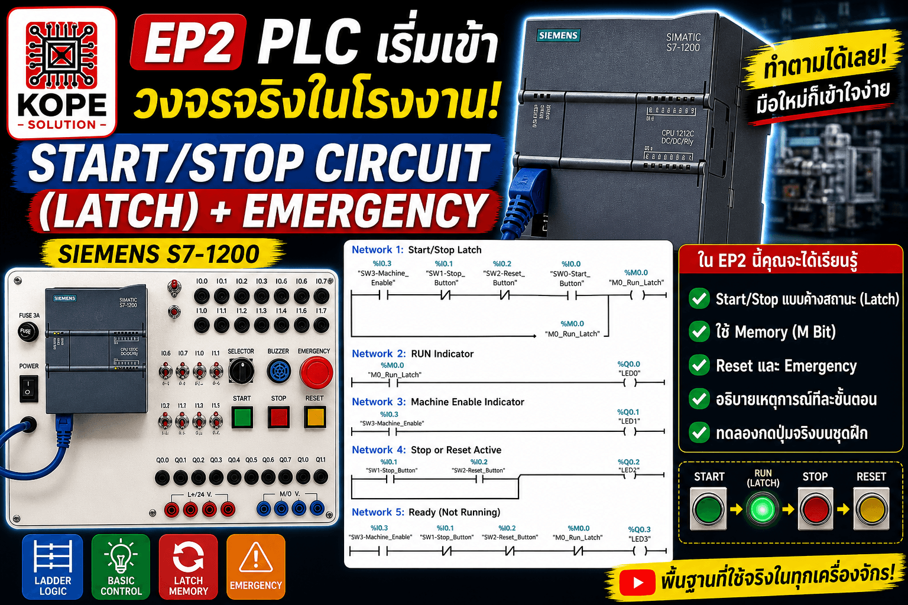
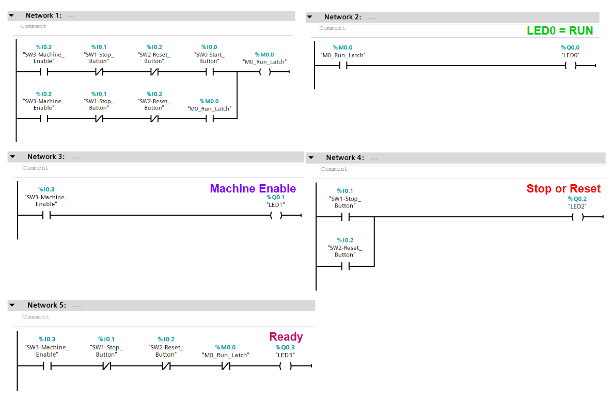

# EP2: Start/Stop Circuit (Latch) + Emergency

## Concepts
- Start / Stop Circuit
- Latch (Memory Bit)
- Reset Function
- Emergency Stop

## Images

## Video
👉 https://youtu.be/YcimmIvBpzg?si=BUl9-Pd_ldI1VB6B

## Summary
This EP demonstrates real industrial control logic using latch behavior and safety logic.
