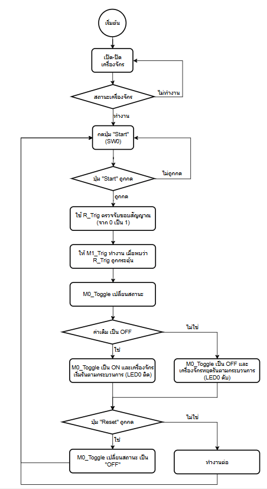
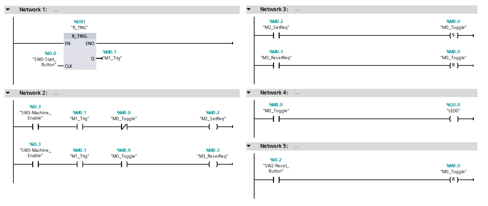

# EP3: Toggle / Flip-Flop Logic

## Concepts
- Toggle ON/OFF
- Flip-Flop (SR)
- Button press behavior

## Images

## Video
👉 [EP3: PLC Toggle / Flip-Flop Logic + R_TRIG](https://youtu.be/-S8t2O3HkqE?si=p_d-s1SEu82vD0in)

## Summary
Control output using toggle logic.

## Ladder Idea
Press once → ON  
Press again → OFF
