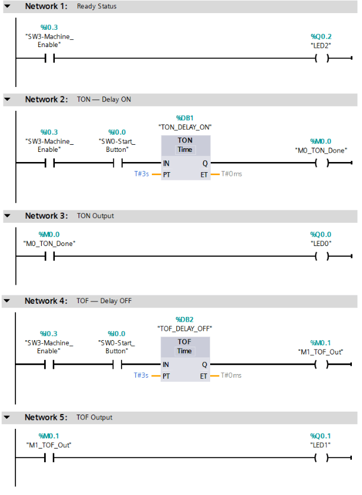

# EP4: Timer Basics (TON / TOF)

## Overview

This episode introduces basic PLC timer instructions using Siemens S7-1200 and TIA Portal.

The main goal is to understand how PLC timers control time-based behavior in industrial automation.

---

## Concepts

- TON: Timer ON Delay
- TOF: Timer OFF Delay
- Preset Time (PT)
- Elapsed Time (ET)
- Timer Output (Q)

---

## I/O Mapping

| Tag | Address | Description |
|---|---:|---|
| SW0-Start_Button | %I0.0 | Timer start button |
| SW3-Machine_Enable | %I0.3 | Machine enable |
| LED1 | %Q0.0 | TON output |
| LED2 | %Q0.1 | TOF output |
| LED0 | %Q0.2 | Ready status |

---

## Ladder Logic

## Video
👉 [EP4: PLC Timer Basics (TON / TOF)](https://youtu.be/82_njdIA_YY)

## Key Learning

TON is used when we want to delay the ON action.

TOF is used when we want to delay the OFF action.

Timers are fundamental in industrial automation systems such as motor delay, alarm delay, signal filtering, and machine sequence control.