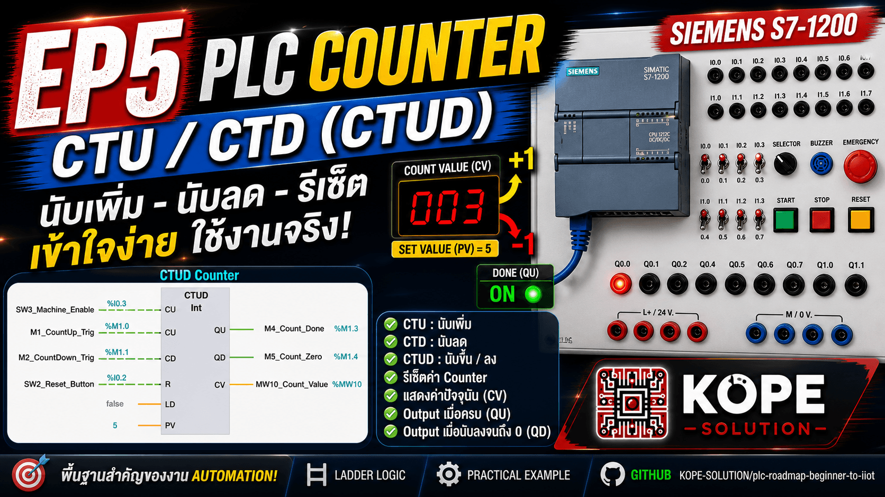
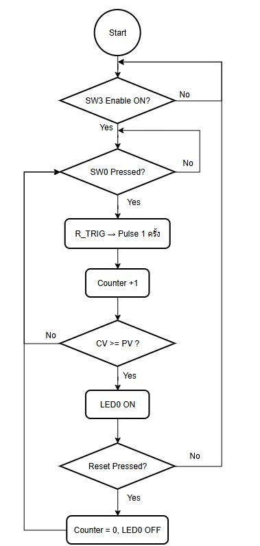
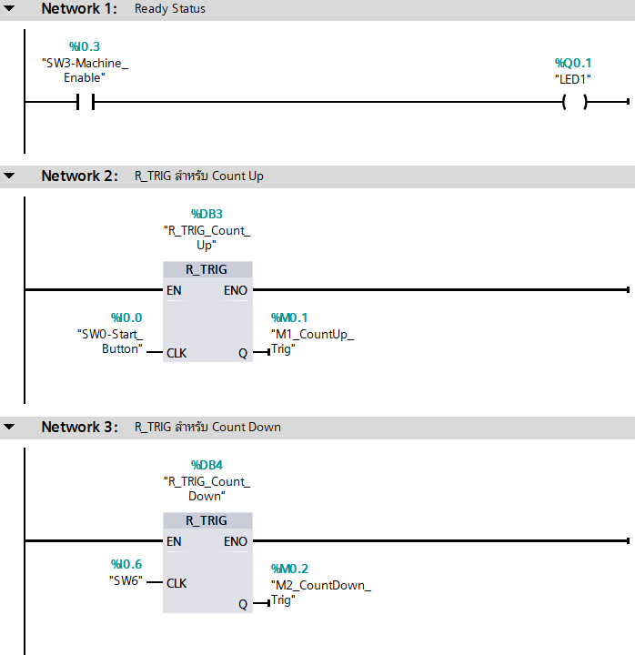
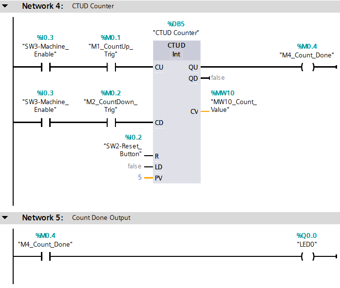

# EP5: Counter Basics (CTU / CTD)

## Overview

This episode introduces PLC counter instructions using Siemens S7-1200 and TIA Portal.

The main goal is to understand how a PLC counts events such as button presses, machine cycles, or product pieces.

---

## Concepts

- CTU: Count Up
- CTD: Count Down
- CTUD: Count Up / Down
- PV: Preset Value
- CV: Current Value
- Q / QU: Counter done output
- Reset counter
- R_TRIG for one-shot counting

---

## Hardware / Software

- Siemens S7-1200
- TIA Portal
- Training Panel
- Push Buttons / Switches
- LED Outputs

---

## I/O Mapping

| Tag | Address | Description |
|---|---:|---|
| SW0-Start_Button | %I0.0 | Count up button |
| SW2-Reset_Button | %I0.2 | Counter reset |
| SW3-Machine_Enable | %I0.3 | Machine enable |
| SW6 | %I0.6 | Count down button |
| LED0 | %Q0.0 | Counter done output |
| LED1 | %Q0.1 | Ready status |
| LED2 | %Q0.2 | Count pulse indicator |

---

## Memory Tags

| Tag | Address | Description |
|---|---:|---|
| M1_CountUp_Trig | %M1.0 | Rising edge pulse for count up |
| M2_CountDown_Trig | %M1.1 | Rising edge pulse for count down |
| M4_Count_Done | %M1.3 | Counter done status |
| MW10_Count_Value | %MW10 | Current counter value |

---

## Ladder Logic

## Video

👉 [EP5: Couter Basics (CTU/CTD)](https://youtu.be/Gsp4bn9lxao)

## Expected Result

| Action              | Result                                        |
| ------------------- | --------------------------------------------- |
| Machine Enable OFF  | Counter does not count                        |
| Machine Enable ON   | Ready LED turns ON                            |
| Press Start once    | Counter value increases by 1                  |
| Press Start 5 times | LED0 turns ON                                 |
| Press Reset         | Counter value returns to 0 and LED0 turns OFF |
| Press SW6           | Counter value decreases by 1                  |

## Key Learning

**A** counter is used to count events.
**R_TRIG** is used before the counter so that one button press creates only one count pulse.
**PV** is the target count value.
**CV** is the current count value.
**Q** or **QU** turns ON when the counter reaches the preset value.

