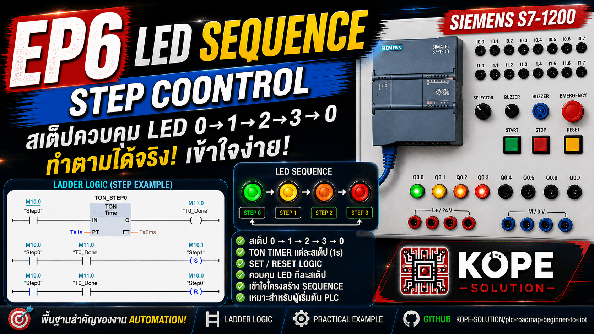
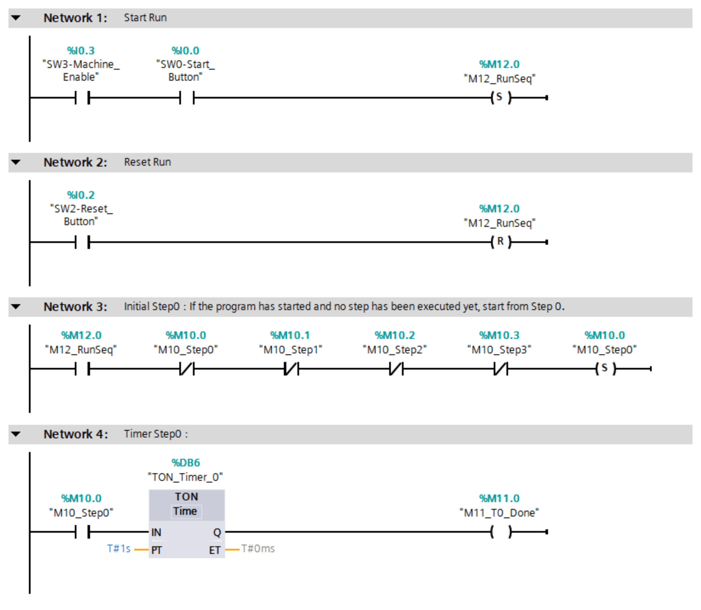
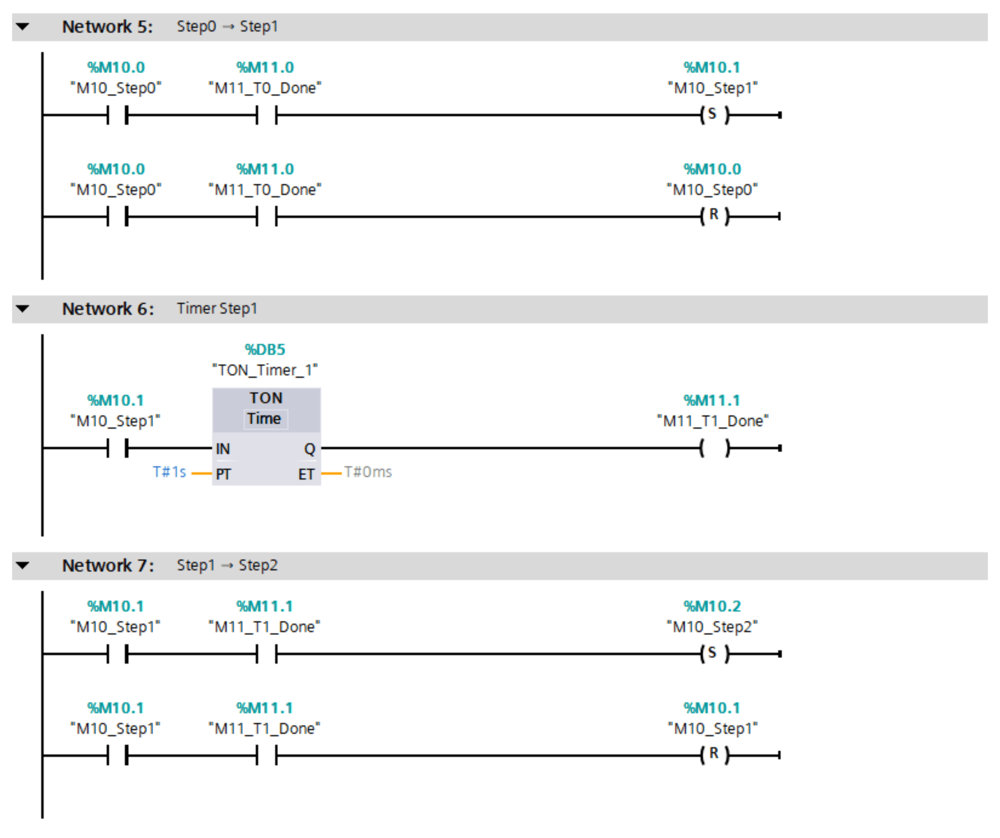
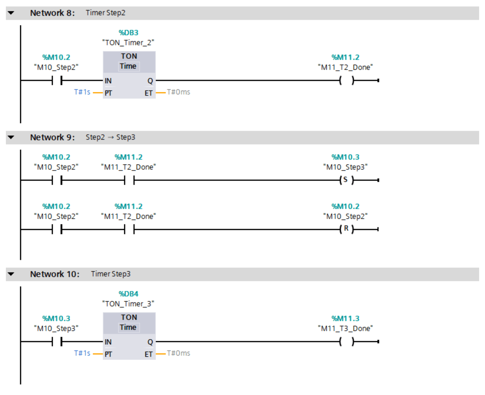
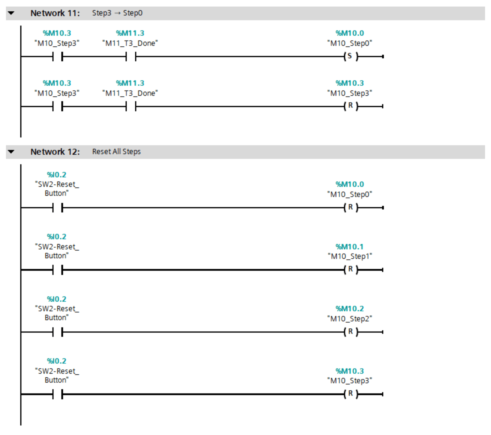
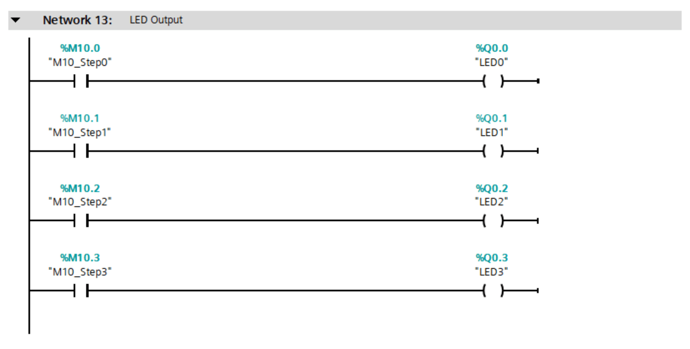

# EP6: LED Sequence / Step Control



## Overview

This episode introduces **Sequence Control** and **Step Logic** using Siemens S7-1200 PLC.

The goal is to control LEDs step-by-step:

```text
LED0 → LED1 → LED2 → LED3 → LED0 ...
```

Each step is controlled by a memory bit and a TON timer.

---

## Concepts
- Sequence Control
- Step Logic
- State Machine Basics
- TON Timer
- Set / Reset Coil
- Memory Bit
- PLC Scan Cycle

---

## I/O Mapping

| Tag                | Address | Description    |
| ------------------ | ------: | -------------- |
| SW0-Start_Button   | `%I0.0` | Start sequence |
| SW2-Reset_Button   | `%I0.2` | Reset sequence |
| SW3-Machine_Enable | `%I0.3` | Machine enable |
| LED0               | `%Q0.0` | Step 0 output  |
| LED1               | `%Q0.1` | Step 1 output  |
| LED2               | `%Q0.2` | Step 2 output  |
| LED3               | `%Q0.3` | Step 3 output  |


---

## Memory Tags

| Tag         |  Address | Description             |
| ----------- | -------: | ----------------------- |
| M12_RunSeq  | `%M12.0` | Sequence running status |
| M10_Step0   | `%M10.0` | Step 0 memory           |
| M10_Step1   | `%M10.1` | Step 1 memory           |
| M10_Step2   | `%M10.2` | Step 2 memory           |
| M10_Step3   | `%M10.3` | Step 3 memory           |
| M11_T0_Done | `%M11.0` | Timer done for Step 0   |
| M11_T1_Done | `%M11.1` | Timer done for Step 1   |
| M11_T2_Done | `%M11.2` | Timer done for Step 2   |
| M11_T3_Done | `%M11.3` | Timer done for Step 3   |

---

## Sequence Flow

```sh
Start Button
    ↓
Run Sequence
    ↓
Step0 → Timer0 → Step1
    ↓
Step1 → Timer1 → Step2
    ↓
Step2 → Timer2 → Step3
    ↓
Step3 → Timer3 → Step0
```

---

## Ladder Logic Summary







---

## Expected Result

| Action                          | Result                               |
| ------------------------------- | ------------------------------------ |
| Machine Enable OFF              | Sequence cannot start                |
| Machine Enable ON + Press Start | LED0 turns ON                        |
| After 1 second                  | LED0 turns OFF, LED1 turns ON        |
| After 1 second                  | LED1 turns OFF, LED2 turns ON        |
| After 1 second                  | LED2 turns OFF, LED3 turns ON        |
| After 1 second                  | LED3 turns OFF, LED0 turns ON again  |
| Press Reset                     | All LEDs turn OFF and sequence stops |

---

## Key Learning

This episode introduces the idea of step-based automation.

Instead of controlling outputs directly, the PLC uses memory bits to represent each step of the machine.

Each step has its own timer. When the timer is done, the PLC resets the current step and sets the next step.

This pattern is widely used in real machines such as:

- Conveyor systems
- Packaging machines
- Assembly lines
- Traffic light control
- Automatic machine cycles

---

## Important Note

Using one shared timer for all steps may cause the sequence to get stuck because the timer may not reset correctly between steps.

For beginners, using one timer per step is easier to understand and more stable.