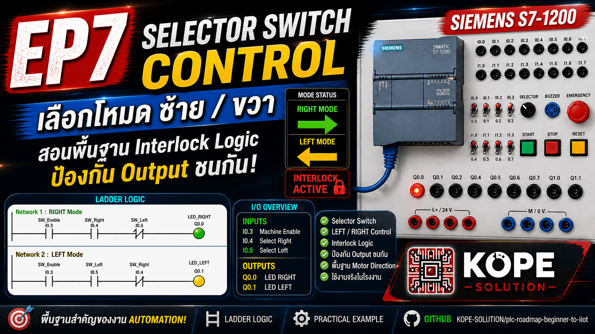
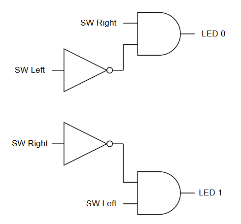
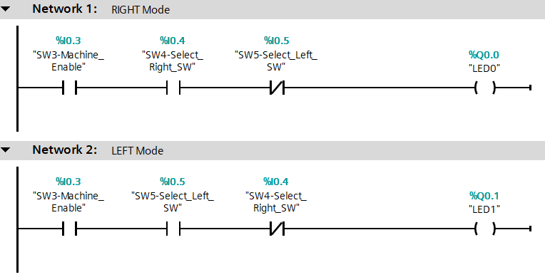

# EP7 — Selector Switch Control

Learn how to use Selector Switch logic in Siemens S7-1200 PLC.

---

## Topics

- Selector Switch
- LEFT / RIGHT Control
- Interlock Logic
- Ladder Logic
- Industrial Safety Basics

---

## Inputs

| Tag | Description |
|---|---|
| I0.3 | Machine Enable |
| I0.4 | Select Right |
| I0.5 | Select Left |

---

## Outputs

| Tag | Description |
|---|---|
| Q0.0 | RIGHT LED |
| Q0.1 | LEFT LED |

---

## Logic

---

## Learning Outcome

- Understand Selector Switch control
- Learn Interlock logic
- Prevent conflicting outputs
- Prepare for Motor Direction Control
- Prepare for Auto / Manual systems