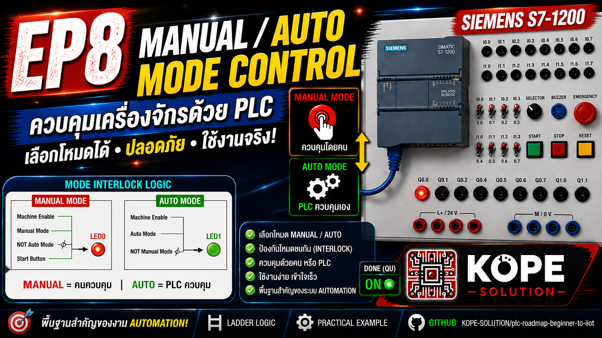
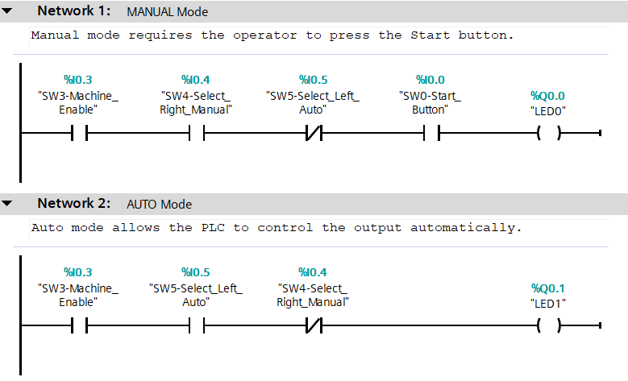

# EP8 — Manual / Auto Mode

Learn how to create Manual and Auto control systems using Siemens S7-1200 PLC.

This episode focuses on the difference between human-controlled systems and PLC-controlled systems.

---

## Topics

- Manual Mode
- Auto Mode
- Mode Selection
- Interlock Logic
- Industrial Automation Basics

---

## Concepts

### Manual Mode

The operator controls the machine manually.

Example: Press button → Output ON

---

### Auto Mode

The PLC controls the machine automatically.

Example: Select AUTO → PLC turns output ON automatically

---

## Inputs

| Tag | Address | Description |
|---|---|---|
| SW3_Machine_Enable | %I0.3 | Machine Enable |
| SW4_Manual_Mode | %I0.4 | Manual Mode |
| SW5_Auto_Mode | %I0.5 | Auto Mode |
| SW0_Start_Button | %I0.0 | Manual Start Button |

---

## Outputs

| Tag | Address | Description |
|---|---|---|
| LED0 | %Q0.0 | Manual Output |
| LED1 | %Q0.1 | Auto Output |

---

## Features

- Manual Control
- Automatic Control
- Mode Interlock
- Basic Industrial Automation Logic

---

## Ladder Logic

---

## Interlock Logic

The PLC prevents Manual and Auto modes from running at the same time.

---

## Expected Result

| Action                    | Result                       |
| ------------------------- | ---------------------------- |
| Manual Mode + Press Start | LED0 turns ON                |
| Auto Mode selected        | LED1 turns ON automatically  |
| Manual + Auto together    | Outputs blocked by interlock |
| Machine Enable OFF        | Outputs OFF                  |

---

## Learning Outcome

- Understand Manual vs Auto systems
- Learn Mode Selection
- Learn Interlock Logic
- Understand Industrial PLC Control
- Prepare for Automation and IIoT systems