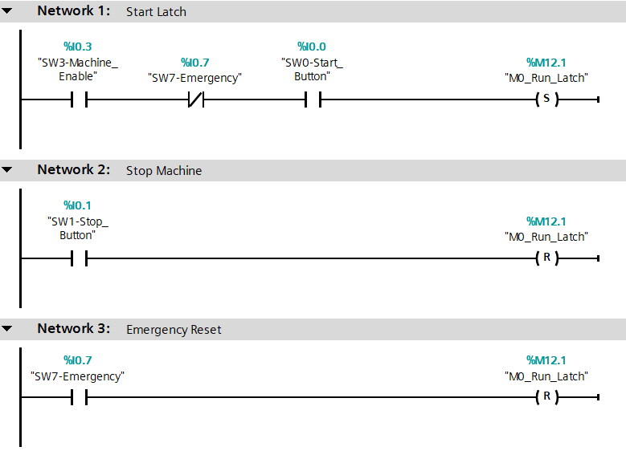
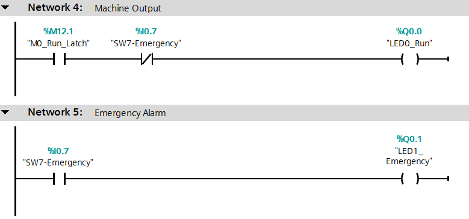
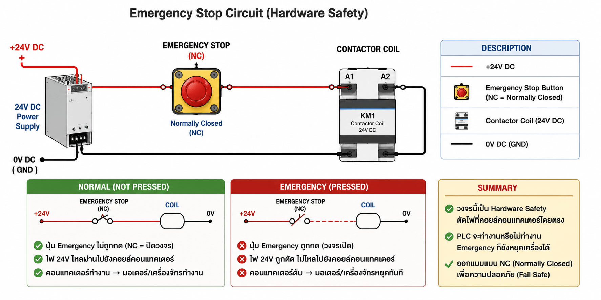

# EP9 — Safety Logic & Emergency Handling

Learn industrial safety logic using Siemens S7-1200 PLC.

This episode introduces Emergency Stop systems and Safety Interlock concepts used in real industrial automation systems.

---

## Topics

- Emergency Stop
- Safety Logic
- Run Latch
- Safety Interlock
- Machine Shutdown
- Industrial Safety Basics

---

## Inputs

| Tag | Address | Description |
|---|---|---|
| SW3_Machine_Enable | %I0.3 | Machine Enable |
| SW0_Start_Button | %I0.0 | Start Button |
| SW1_Stop_Button | %I0.1 | Stop Button |
| SW7_Emergency | %I0.7 | Emergency Stop |

---

## Outputs

| Tag | Address | Description |
|---|---|---|
| LED0_Run | %Q0.0 | Machine Running |
| LED1_Emergency | %Q0.1 | Emergency Alarm |

---

## Memory Tags

| Tag | Address | Description |
|---|---|---|
| M0_Run_Latch | %M0.0 | Machine Run Latch |

---

# Ladder Logic





---

# Important Safety Note

This episode demonstrates software safety logic for educational purposes.

---

## Software Safety

```text
Machine_Enable AND NOT Emergency 
```

"The machine will only operate when no emergency has occurred."

or

```text
Emergency → Reset Run Latch
```

"In case of an emergency, the PLC should immediately cancel the machine's RUN status."

---

## Real Industrial Safety

In real factories, Emergency Stop systems should NOT rely only on PLC logic.

Industrial systems normally use:
- Emergency Relay
- Safety Relay
- Safety PLC
- Contactor Shutdown
- Servo Enable Cutoff
- Hardware Safety Circuit

Example:



When Emergency is pressed:
- Power is physically disconnected
- Motor stops immediately
- Machine becomes safe even if PLC fails

---

## Real Industrial Architecture

```text
Emergency Button
        ↓
Safety Relay
        ↓
Contactor / Motor Power
        ↓
Machine OFF
```

At the same time:

```text
Emergency Signal
        ↓
PLC Input
        ↓
Alarm / HMI / SCADA
```

---

## Learning Outcome

- Understand Emergency Stop systems
- Learn Safety Interlock logic
- Learn industrial shutdown logic
- Understand fail-safe concepts
- Prepare for real industrial automation systems

---

# Final Concept

```text
Automation without safety is dangerous.
```
