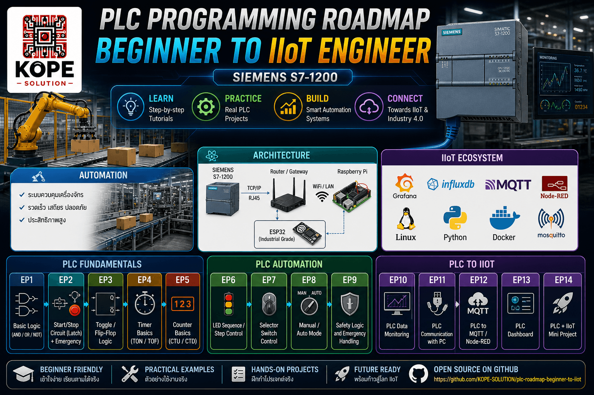

# PLC Programming Roadmap (Siemens S7-1200)



A hands-on learning series from basic ladder logic to industrial automation and IIoT.

## Episodes

### PLC Fundamentals

- [EP1: Basic Logic (AND / OR / NOT)](./EP1-Basic-Logic/README.md)
- [EP2: Start/Stop Circuit (Latch) + Emergency](./EP2-StartStop/README.md)
- [EP3: Toggle / Flip-Flop Logic](./EP3-Toggle/README.md)
- [EP4: Timer Basics (TON / TOF)](./EP4-Timer-Basics/README.md)
- [EP5: Counter Basics (CTU / CTD)](./EP5-Counter-Basics/README.md)

### PLC Automation

- [EP6: LED Sequence / Step Control](EP6-LED-Sequence-Control/README.md)
- [EP7: Selector Switch Control](EP7-Selector-Switch-Control/README.md)
- [EP8: Manual / Auto Mode](EP8-Manual-Auto-Mode/README.md)
- [EP9: Safety Logic and Emergency Handling](EP9-Safety-Logic-Emergency-Handling/README.md)

### PLC to IIoT

- [EP10: PLC Data Monitoring](EP10-PLC-Data-Monitoring/README.md)
- [EP11: PLC Communication with PC](EP11-PLC-Communication-with-PC/README.md)
- [EP12: PLC to MQTT / Node-RED](EP12-PLC-to-MQTT-NodeRED/README.md)
- [EP13: PLC Dashboard](EP13-PLC-Dashboard-NodeRED/README.md)
- EP14: PLC + IIoT Mini Project

## YouTube Video

- [EP1: Basic Logic (AND / OR / NOT)](https://youtu.be/BJGo-j6a0_c?si=gdBQ90fzEpMhJKM0)
- [EP2: Start/Stop Circuit (Latch) + Emergency](https://youtu.be/YcimmIvBpzg?si=BUl9-Pd_ldI1VB6B)
- [EP3: PLC Toggle / Flip-Flop Logic + R_TRIG](https://youtu.be/-S8t2O3HkqE?si=p_d-s1SEu82vD0in)
- [EP4: PLC Timer Basics (TON / TOF)](https://youtu.be/82_njdIA_YY)
- [EP5: Couter Basics (CTU/CTD)](https://youtu.be/Gsp4bn9lxao)
- [EP6: LED Sequence / Step Control](https://youtu.be/xPKJ8xttxAs?si=RFd-dyumXBMR9gtQ)
- [EP7: Selector Switch Control](https://youtu.be/HdoPTU_7QGE?si=3iEiyeVjpQQnSZ5X)
- [EP8: Manual / Auto Mode](https://youtu.be/6NMlEiyF_Kk?si=kFa8mSmBHxIZWEv3)
- [EP9: Safety Logic and Emergency Handling](https://youtu.be/yWszjPWKLWc?si=PoH_98gOj-Z1dvOA)
- [EP10: PLC Data Monitoring](https://youtu.be/bd6XKbTyVKI)
- [EP11: PLC Communication with PC](https://youtu.be/MGes7-Dfpz4?si=Of88M1tzov0D3vy2)
- [EP12: PLC to MQTT / Node-RED Part 1/2](https://youtu.be/icaPqXklgpE?si=HWr2L8UI2bk9TvRr)
- [EP12: PLC to MQTT / Node-RED Part 2/2](https://youtu.be/UOf17ojnyQU?si=4u8ngIPzTRm1TYMm)

## Goal
Build real industrial PLC skills step-by-step and extend to IIoT systems.

Learning path:
```sh
Basic Logic
→ Start/Stop Control
→ Memory and Latch
→ Timer / Counter
→ Sequence Control
→ Industrial Automation
→ PLC Data Communication
→ IIoT Integration
```

## Hardware / Software
- Siemens S7-1200 PLC
- TIA Portal
- Training Panel / Control Panel
- LED Output Module
- Push Buttons / Selector Switches

---

Follow the journey and explore each EP folder for details.
